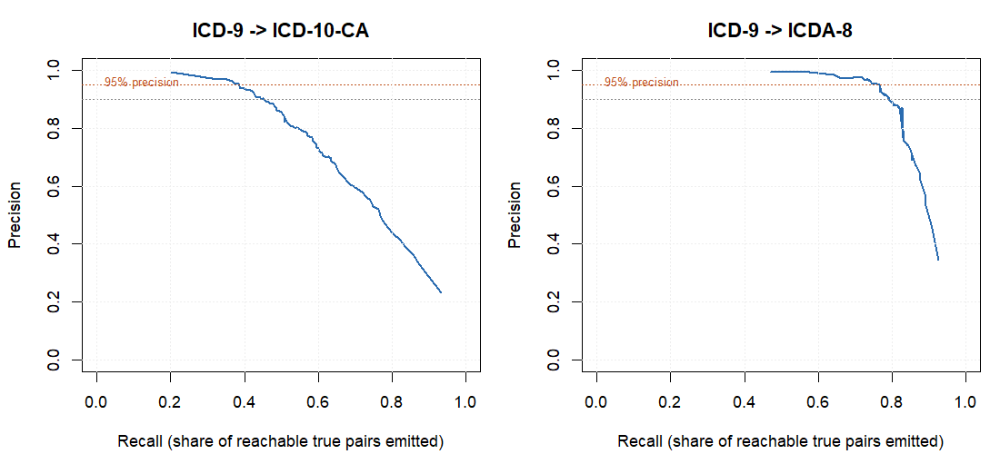

# ICD Crosswalk Automation

Maps old medical diagnosis codes to newer ones automatically.

When a country switches coding systems, decades of health records are stuck in
the old system. Someone has to build a crosswalk, a mapping from every old
code to its modern equivalent and that is normally done by hand, by clinical
coders, over months.

This builds most of that mapping automatically and tells you which parts it is
confident about, so a human only reviews the rest.

It is tested on two migrations:

- **ICD-9-CM → ICD-10-CA** (Canadian, the modern standard)
- **ICD-9-CM → ICDA-8** (historical, going backwards)

## Results

Measured with 5-fold cross-validation grouped by code, so every number is on
codes the system never saw while training.

| | ICD-9 → ICD-10-CA | ICD-9 → ICDA-8 |
|---|---|---|
| Previous pipeline (F1) | 0.546 | 0.824 |
| **This system (F1)** | **0.668** | **0.840** |

The more useful number for actually using it; how much of the crosswalk gets
built with no human involved, if you require 95% of those mappings to be right:

| | ICD-9 → ICD-10-CA | ICD-9 → ICDA-8 |
|---|---|---|
| **Built automatically** | **43%** | **79%** |
| Sent for human review | 57% | 21% |

At a stricter 99% precision, ICDA-8 still builds 64% automatically.



## How it works

Two stages.

**1. Retrieve.** For each old code, gather plausible new codes from three
embedding models (SapBERT, mpnet, ClinicalBERT) plus historical co-occurrence.
This stage is tuned for recall — a correct answer missed here can never be
recovered later.

**2. Rerank.** Score every candidate with a gradient-boosted model and keep the
good ones. Features include each model's similarity and rank, agreement between
models, whether the two codes pick *each other* as best match, co-occurrence
frequency, chapter compatibility learned from the data, and plain word overlap
between the labels.

Each mapping comes out with a confidence score, which is what makes the
auto-accept / review split possible.

### Why two stages

The original pipeline kept a candidate only if its similarity was within 5% of
the best match for that code. That sounds reasonable and is not — it threw away
63% of correct answers before ranking even started. Since a dropped candidate
can never be recovered, this capped the best possible F1 at **0.77**, no matter
what model or ranker you put downstream.

Every correct answer was sitting in the similarity matrix. The pipeline just
never looked at it. Switching to plain top-K retrieval raised that ceiling to
**0.96**.

## Charts

| | |
|---|---|
|  |  |
| Model comparison | Precision vs recall |

## Running it

Needs R. From `scripts/`:

```r
source("11_rerank_features.R")   # build candidates and features
source("12_cv_rerank.R")         # train and evaluate  (~10 min)
source("13_precision_coverage.R")# confidence thresholds and triage
source("14_predict_crosswalk.R") # map codes with no known answer
```

Both tracks can run at once:

```bash
Rscript 12_cv_rerank.R 10_9  &
Rscript 12_cv_rerank.R 8_9   &
Rscript 12b_merge_cv_results.R
```

Then build the report from the project root:

```r
rmarkdown::render("report.Rmd")
```

R packages: `dplyr`, `tidyr`, `readxl`, `writexl`, `stringr`, `purrr`,
`ggplot2`, `xgboost`, `jsonlite`, `knitr`, `rmarkdown`, `reticulate`.

Python is only needed to regenerate embeddings (`torch`, `transformers`,
`sentence-transformers`, `pandas`, `openpyxl`):

```bash
python generate_embeddings.py --model mpnet --clean base
```

### Earlier scripts

`02`–`10` are the analysis that led here and still run: model comparison
(`02`, `07`, `08`), reverse-direction mapping (`05`), and the diagnostics that
found the ceiling problem (`09`, `10`).

## Using it on other code systems

To point this at a different migration you need, per code system:

- code labels (code → text description)
- co-occurrence counts between old and new codes, from records coded both ways
- a chapter/category grouping, if one exists
- some manually verified mappings for training — a few hundred is enough

Then swap the paths in the `TRACKS` list at the top of `11_rerank_features.R`.

## Layout

```
data/original/    labels, co-occurrence tables, manual crosswalks
data/sapbert/     SapBERT similarity matrices
data/generated/   regenerated / filler-stripped / mpnet matrices
scripts/          pipeline code
results/          csv output and charts
report.Rmd        full write-up with methodology and caveats
```

## Limitations

- Tested on 354 three-digit ICD-9 categories, not the full ~14,000 code set.
- 937 and 331 manually verified pairs. Small.
- ICD-10-CA is the harder track and 0.668 is a long way from its 0.96 ceiling.
  Most codes map to more than one target and the boundaries are judgement
  calls that human coders disagree on.
- Only tested on these two migrations. Transfer to other systems is untested.

## License

MIT see [LICENSE](LICENSE).