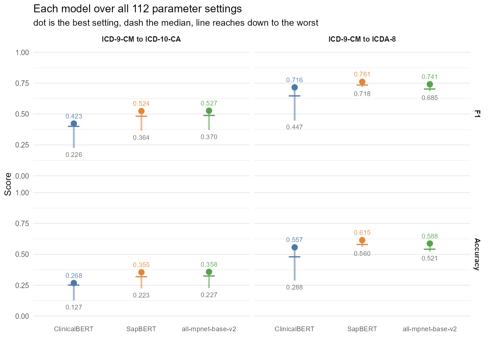
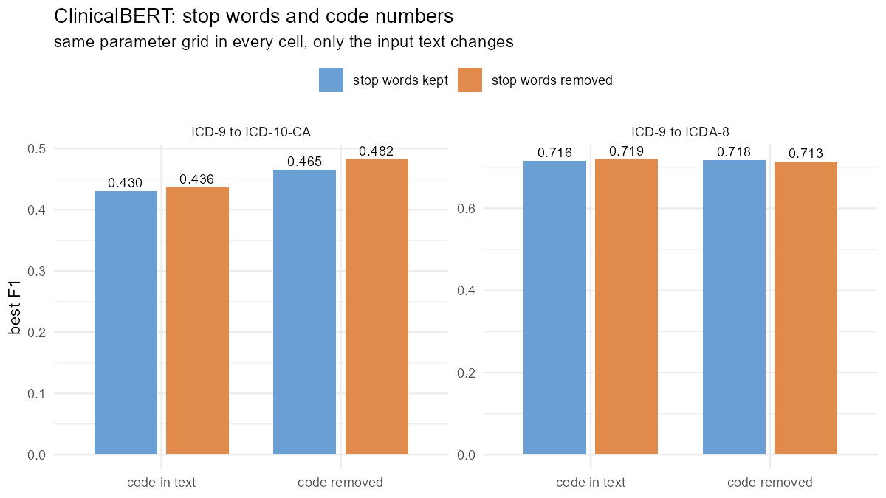
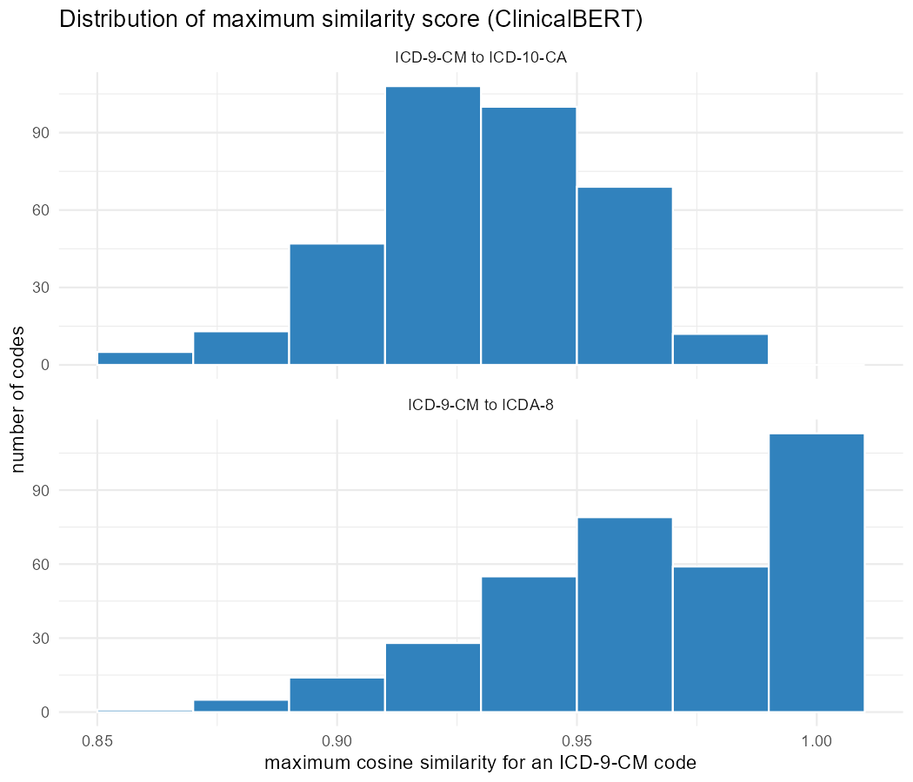
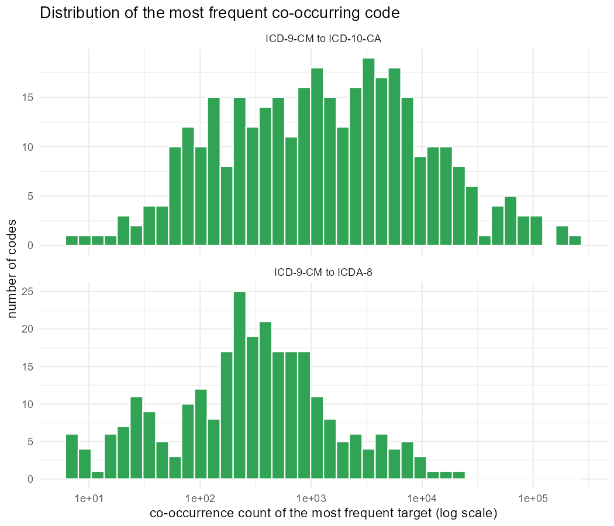

# Report

---

## Summary

The original pipeline converted each ICD code label into a numeric
representation using ClinicalBERT, selected candidate target codes whose
similarity scores were close to the highest score for that code, added the most
frequently co-occurring target codes, removed pairs whose chapters did not
align, and reported whatever passed one of four mapping algorithms. The best F1
score was 0.427 for ICD-9-CM to ICD-10-CA and 0.716 for ICD-9-CM to ICDA-8.

We rebuilt the pipeline in R and reproduced both of those figures exactly. We
then replaced ClinicalBERT with a newer model, SapBERT, which raised the
ICD-9-CM to ICD-10-CA F1 score from 0.427 to 0.530. Further investigation showed
that the language model was not what limited performance. We traced each
manually mapped pair through the pipeline and found that the similarity cutoff
in Step 1 removed 63% of the correct ICD-10-CA pairs before any selection took
place. Once a pair is removed at that step it cannot be recovered later, so no
version of Step 4 could have produced an F1 score above 0.770.

That finding sets the direction for the work that follows. Widening Step 1 so
that a fixed number of candidates is kept for each ICD-9-CM code, rather than a
number that depends on that code's best similarity score, would raise the
reachable limit from 0.770 to 0.927. Nothing in this document changes Step 4,
and the remaining sections address the specific questions raised in review:
whether the code number belongs in the embedded text, which standard stop word
dictionary to use, and how the two quantities the pipeline thresholds on are
actually distributed. Section 10 sets out what we propose to do next.

---

## 1. Rebuilding the Pipeline in R

The original analysis was written as two Python notebooks. We ported both to R,
keeping the same steps in the same order, so that later changes could be
compared against a working reproduction rather than against reported figures.

Two differences had to be resolved before the original results could be
reproduced. First, the original validated against the CIHI crosswalk table,
which is not in the shared project folder, so we repointed the validation step
at the validation sheets that are shared. Second, the range of co-occurrence Top
N values differed between the two crosswalks in the original code, running from
1 to 10 for ICD-10-CA and from 5 to 30 for ICDA-8. We swept 3 to 30 for both.
The best ICD-10-CA result occurs at a Top N of 30, which is beyond the point
where the original search stopped, and this is why the F1 score of 0.427 did not
reproduce at first. We also added 0.95 to the list of similarity thresholds,
since a threshold of 1.0 keeps only candidates tied with the highest score.

With both corrections the R version reproduces 0.427 and 0.716 exactly.

We also rewrote the chapter alignment lookup and the merging step to work on
whole columns at once rather than row by row. This made the pipeline
approximately 130 times faster with identical output, which is what made the
larger parameter searches described below practical.

---

## 2. Comparing Language Models

ClinicalBERT was published in 2019. We tested two more recent models in its
place. SapBERT is trained specifically on medical vocabulary and the
relationships between medical terms. The second, all-mpnet-base-v2, is a
general-purpose model with no medical training at all, included as a control.

So that the comparison would be fair, we regenerated the embeddings for all
three models with a single script, using identical text cleaning and identical
settings, and evaluated all of them over the same 112 parameter combinations per
crosswalk.

**Table 1. Best F1 score by embedding model.**

| Model | ICD-9-CM to ICD-10-CA | ICD-9-CM to ICDA-8 |
|---|---|---|
| ClinicalBERT (original results) | 0.427 | 0.716 |
| ClinicalBERT (regenerated) | 0.430 | 0.716 |
| SapBERT | 0.530 | 0.821 |
| all-mpnet-base-v2 | 0.533 | 0.769 |

**Figure 1. F1 score and accuracy for ClinicalBERT and SapBERT at the best
parameter combination for each model and crosswalk.**

SapBERT is the stronger model, improving F1 by approximately 0.10 on both
crosswalks. The result worth noting is that all-mpnet-base-v2, which has no
medical training, performs as well as SapBERT on ICD-10-CA. Medical
pre-training is therefore not the deciding factor in this task, which was the
first indication that the model was not the main constraint.

During this work we found and corrected a fault in our own code, in which two
conditions whose names differed only in capitalisation were written to the same
file on Windows, so that parallel jobs overwrote one another's results. All
eight conditions were rerun after the fix.

---

## 3. Reviewing the Filler Word List

The cleaning step used a hand-written list of words to remove from labels before
embedding. We compared this list against four published stop word lists, which
are standard word lists distributed with the NLTK and stopwords packages.

Long lists proved unsafe for this task. Two different codes can end up with
identical text once enough words are removed, and when that happens the pipeline
cannot tell them apart at all. The SMART list produces 23 such collisions and
the stopwords-iso list produces 26, largely because they remove single letters
and the words "with" and "without", so that "hepatitis a" and "hepatitis b"
become the same string.

We removed the words "other", "others", "unspecified", "with" and "without"
from the local list, which between them merged 10 codes, and added an automatic
check that stops the pipeline if any word list causes two codes to share the
same cleaned label.

---

## 4. Finding Where Correct Mappings Were Lost

This section contains the central finding of the work.

Rather than only measuring the final score, we followed every manually mapped
pair through the pipeline and recorded the stage at which it was lost. A pair
removed at an early stage cannot be recovered by a later one, so the earliest
loss sets an upper limit on everything that follows.

**Table 2. Percentage of manually mapped pairs still present at each stage of
the original pipeline.**

| Stage | ICD-9-CM to ICD-10-CA | ICD-9-CM to ICDA-8 |
|---|---|---|
| Passed the Step 1 similarity cutoff | 37.1% | 79.5% |
| Present in the Step 2 co-occurrence list | 55.4% | 71.6% |
| Present in the candidate set after Step 3 | 62.6% | 85.2% |
| Reported by the Step 4 mapping algorithms | 42.9% | 78.5% |
| Best F1 obtainable from the candidate set | 0.770 | 0.920 |

The similarity cutoff in Step 1 discards 63% of the correct ICD-10-CA pairs
before any mapping algorithm is applied. Because those pairs are gone, the best
F1 score that Step 4 could possibly have achieved was 0.770, no matter which
mapping algorithm was chosen or how the parameters were tuned.

We then tested whether those discarded pairs were recoverable. Replacing the
relative similarity cutoff with a fixed number of candidates per ICD-9-CM code,
removing the chapter filter, and lengthening the co-occurrence list raises the
best obtainable F1 score from 0.770 to 0.927 for ICD-10-CA and from 0.920 to
0.976 for ICDA-8. The correct answers were present and ranked highly enough to
be retrieved. They were being discarded by the selection rule rather than missed
by the model, and this is the evidence that the model was not the limiting
factor.

We also examined the chapter distance filter in Step 3 specifically, and found
that it removes more correct pairs than incorrect ones. Chapter alignment is
still used, but as one input to the scoring step rather than as a filter that
deletes candidates outright.

---

## 5. How Performance Is Measured

The figures in the original analysis were calculated on the same pairs that were
used to choose the parameters. The search over 96 combinations of similarity
threshold, Top N and mapping algorithm selected whichever combination scored
highest against the manual crosswalk, and that score was then reported. This
tends to overstate performance, because the search can settle on values that
happen to suit the particular codes being scored rather than values that would
hold for codes it has not seen.

We therefore re-measured the original pipeline using five-fold cross-validation
in which the folds are divided by ICD-9-CM code, so that the parameters are
chosen on one set of codes and the score is calculated on a different set.

**Table 3. The original pipeline scored in sample and on unseen codes, using
SapBERT embeddings.**

| | ICD-9-CM to ICD-10-CA | ICD-9-CM to ICDA-8 |
|---|---|---|
| Parameters chosen and scored on the same codes | 0.547 | 0.824 |
| Parameters chosen on one set, scored on unseen codes | 0.546 | 0.824 |

The difference is negligible. Because the pipeline has only three parameters to
tune, there is very little scope for it to fit itself to the particular codes
being scored, and the original figures are not inflated by the way they were
measured. This is worth establishing explicitly, since it means the improvement
from 0.427 to 0.530 in Section 2 is attributable to the change of embedding
model and not to the evaluation procedure.

We recommend that cross-validation of this kind be used for any future
comparison, since a method with more parameters than the present one would not
be as forgiving.

## 6. Including the Code Number in the Text

The original analysis combined each ICD code with its label into a single text
string before embedding, so that the model received text such as "250 diabetes
mellitus" rather than "diabetes mellitus". We tested the effect of embedding the
label alone.

The tables below report retrieval results only, measured on similarity scores
before any scoring or selection takes place.

**Table 4. Effect of removing the code number, ICD-9-CM to ICD-10-CA.**

| | Correct target ranked highest | In top 10 | In top 25 | In top 50 |
|---|---|---|---|---|
| ClinicalBERT, code and label | 34.8% | 27.7% | 35.0% | 43.4% |
| ClinicalBERT, label only | **58.6%** | 33.9% | 41.2% | 48.5% |
| SapBERT, code and label | 79.7% | 58.5% | 68.3% | 73.5% |
| SapBERT, label only | **90.1%** | 64.8% | 73.8% | 81.5% |
| all-mpnet-base-v2, code and label | 80.9% | 65.5% | 77.0% | 85.1% |
| all-mpnet-base-v2, label only | **89.9%** | 67.7% | 77.8% | 85.8% |

**Table 5. Effect of removing the code number, ICD-9-CM to ICDA-8.**

| | Correct target ranked highest | In top 10 | In top 25 | In top 50 |
|---|---|---|---|---|
| ClinicalBERT, code and label | **58.3%** | 69.2% | 76.7% | 80.4% |
| ClinicalBERT, label only | 55.0% | 62.5% | 69.5% | 73.7% |
| SapBERT, code and label | **84.1%** | 93.1% | 95.5% | 97.6% |
| SapBERT, label only | 81.8% | 90.6% | 92.5% | 94.0% |
| all-mpnet-base-v2, code and label | **77.8%** | 87.3% | 93.1% | 95.8% |
| all-mpnet-base-v2, label only | 74.5% | 85.2% | 90.9% | 94.9% |

All three models improve on ICD-10-CA and decline on ICDA-8 when the code number
is removed. Because the direction is the same for every model, the explanation
lies in the code sets rather than in any particular model. ICD-9-CM and
ICD-10-CA numbering are unrelated, so the number carries no useful information
and acts as noise. By contrast, 69.8% of ICD-9-CM to ICDA-8 pairs share the same
code number, so for that crosswalk the number is genuinely informative.

ClinicalBERT benefits most, gaining 23.8 percentage points on ICD-10-CA compared
with 10.4 for SapBERT and 9.0 for all-mpnet-base-v2. ClinicalBERT is also the
weakest of the three at reading the labels themselves, which suggests it was
relying on the code number more heavily than the others.

---

## 7. Choosing a Standard Stop Word Dictionary

Stop words are common words such as "the", "of" and "and" that carry little
meaning on their own. The original analysis did not remove them. We were asked
to identify a suitable published dictionary and to confirm the choice before
applying it.

We compared four published English dictionaries. The important consideration is
not the size of the dictionary but whether removing its words causes two
different codes to end up with the same cleaned label, since the pipeline cannot
distinguish codes in that situation.

**Table 6. Published stop word dictionaries compared.**

| Dictionary | Words | Codes made identical |
|---|---|---|
| Snowball | 175 | 4 |
| NLTK | 179 | 8 |
| SMART | 571 | 23 |
| stopwords-iso | 1298 | 26 |

Snowball causes the fewest collisions, and the four it does cause involve codes
that are not part of the validation data. The collisions caused by NLTK do
involve validation codes. On that basis we recommend Snowball.

Snowball nonetheless has one weakness for this application. It removes the
single letters "a" and "i", so that "vitamin a deficiency" becomes "vitamin
deficiency" and "acute hepatitis a" becomes "acute hepatitis", which loses
exactly the character that distinguishes those codes from their neighbours. It
also removes "no", "not" and "nor", which reverse the meaning of a label.
Retaining those five words leaves a dictionary of 170 words that still alters
2,347 labels, compared with 2,381 for the full list, and causes no collisions at
all.

---

## 8. Applying Stop Word Removal to ClinicalBERT

We reran ClinicalBERT under all four combinations of removing stop words and
removing the code number, using the same parameter search each time, so that the
only difference between the four results is the text given to the model.

**Table 7. Best F1 score for ClinicalBERT under each text preparation.**

| ICD-9-CM to ICD-10-CA | Code number included | Code number removed |
|---|---|---|
| Stop words retained | 0.430 | 0.465 |
| Stop words removed | 0.436 | **0.482** |

| ICD-9-CM to ICDA-8 | Code number included | Code number removed |
|---|---|---|
| Stop words retained | 0.716 | 0.718 |
| Stop words removed | 0.719 | 0.713 |

**Figure 2. Best F1 score for ClinicalBERT under each combination of text
preparation.**

Removing stop words improves the ICD-10-CA result by 0.006 when the code number
is present and by 0.017 when it is not. It has no meaningful effect on ICDA-8.
Removing the code number is the larger of the two changes, worth between 0.035
and 0.046 on ICD-10-CA, which agrees with the retrieval results in Section 6.
The two changes combine, and the best result is obtained with both applied,
giving 0.482 against 0.427 for the original ClinicalBERT configuration.

The ICDA-8 result stays between 0.713 and 0.719 whatever is done to the text.
Nothing in the cleaning process affects that crosswalk.

We also ran both versions of the Snowball dictionary so that the choice
described in Section 7 could be made on evidence.

**Table 8. Best F1 score with each version of the Snowball dictionary.**

| | Snowball as published (175 words) | Snowball retaining letters and negations (170 words) |
|---|---|---|
| ICD-9-CM to ICD-10-CA | 0.439 | 0.436 |
| ICD-9-CM to ICDA-8 | 0.717 | 0.719 |

The two versions score the same to within the noise of the measurement. The
reason to prefer the version that retains the five words is therefore not the F1
score but the labels themselves, since the published version silently removes
the letter that identifies several vitamin deficiency and hepatitis codes.

---

## 9. What the Similarity and Co-occurrence Numbers Look Like

Steps 1 and 2 of the original pipeline each cut a list short using a number.
Step 1 uses the similarity score and Step 2 uses how often two codes appear
together in the health records. We were asked to show what those two numbers
actually look like across all the codes rather than assume it.

### The similarity score

For each of the 354 ICD-9-CM codes we took its best similarity score against any
target code.

**Table 9. Best similarity score available for each ICD-9-CM code,
ClinicalBERT.**

| | ICD-9-CM to ICD-10-CA | ICD-9-CM to ICDA-8 |
|---|---|---|
| Lowest | 0.853 | 0.865 |
| Middle value | 0.930 | 0.968 |
| Codes whose best match is a word for word identical label | 0 | 98 |

**Figure 3. How the best available similarity score is spread across the 354
ICD-9-CM codes.**

Two things follow from this.

The first is that every code has a best match above 0.85, so there is no single
score that separates good matches from bad ones. A score of 0.90 might be the
best match one code has and only the tenth best another code has. This is why
the original analysis compared each candidate against that code's own best score
instead of using one fixed cutoff, and that was the right decision.

The second is that ICDA-8 scores higher across the board. Of the 354 ICD-9-CM
codes, 98 have an ICDA-8 code whose label is word for word identical, so those
mappings need no interpretation at all. Not one ICD-9-CM code has an identical
label to an ICD-10-CA code, because ICD-10-CA was rewritten while ICDA-8 was
not. This is the simplest explanation for why every ICDA-8 result in this
document is higher than the matching ICD-10-CA result. It is a difference
between the code sets, not between the methods.

### How often two codes appear together

**Table 10. How often the most frequent partner of each ICD-9-CM code appears
alongside it.**

| | ICD-9-CM to ICD-10-CA | ICD-9-CM to ICDA-8 |
|---|---|---|
| Codes with co-occurrence data | 347 of 354 | 270 of 354 |
| Codes with none | 7 | 84 |
| Middle value | 1,296 | 326 |
| Highest | 238,548 | 19,099 |

**Figure 4. How the co-occurrence count of each code's most frequent partner is
spread, on a scale where each step is ten times the last.**

The counts differ enormously from one code to another, from single figures up to
238,548. A count of 300 is therefore a strong signal for one code and a weak one
for another, and the raw count cannot be compared between codes. Any use of the count
should therefore take account of where a target ranks within its own ICD-9-CM
code, rather than comparing counts across codes.

The other point is that 84 ICD-9-CM codes, close to a quarter, have no ICDA-8
co-occurrence data at all. For those codes Step 2 of the original pipeline
contributes nothing and the mapping rests entirely on the labels.

---

## 10. Proposed Next Steps

Three things follow from the results above. They are listed in the order we
would propose to address them, and none has been adopted.

**Widening Step 1.** Section 4 shows that the similarity cutoff discards 63% of
the correct ICD-10-CA pairs before Step 4 is reached, and that keeping a fixed
number of candidates per ICD-9-CM code instead would raise the reachable limit
from 0.770 to 0.927. This is a change to one step of the existing pipeline
rather than a replacement for it, and it is the single change with the most to
gain. It would need Step 4 to be re-tuned, since the four mapping algorithms
were chosen against a much smaller candidate set.

**Codes with several correct targets.** At the operating points used above,
ICD-9-CM codes with a single correct target are mapped correctly 87% to 88% of
the time on both crosswalks, while codes with several correct targets are mapped
completely 6% of the time for ICD-10-CA and 0% for ICDA-8. Since 63% of ICD-9-CM
codes have more than one ICD-10-CA target against 8% for ICDA-8, this accounts
for essentially the whole difference in performance between the two crosswalks.
The remaining problem is therefore not recognising the right clinical concept
but deciding how many target codes one ICD-9-CM code should expand into. We have
checked whether the additional targets tend to fall in consecutive blocks of the
target classification, and they partly do, which may offer a way in.

**A scoring step between retrieval and reporting.** We have separately
prototyped a version that keeps a wide candidate set and then scores each
candidate pair with a model trained on the manually mapped pairs, before the
reporting rule is applied. Measured on unseen codes it reaches F1 0.668 for
ICD-10-CA and 0.840 for ICDA-8, against 0.546 and 0.824 for the original rules
measured the same way. It is not presented here because it departs from the
existing methodology in a way that should be discussed before it is adopted, and
because the improvement combines two changes, the wider candidate set and the
scoring model, which we have not yet separated. It also requires manually mapped
codes in order to train, which the present pipeline does not. The work is kept
on the `testing` branch of the repository.
