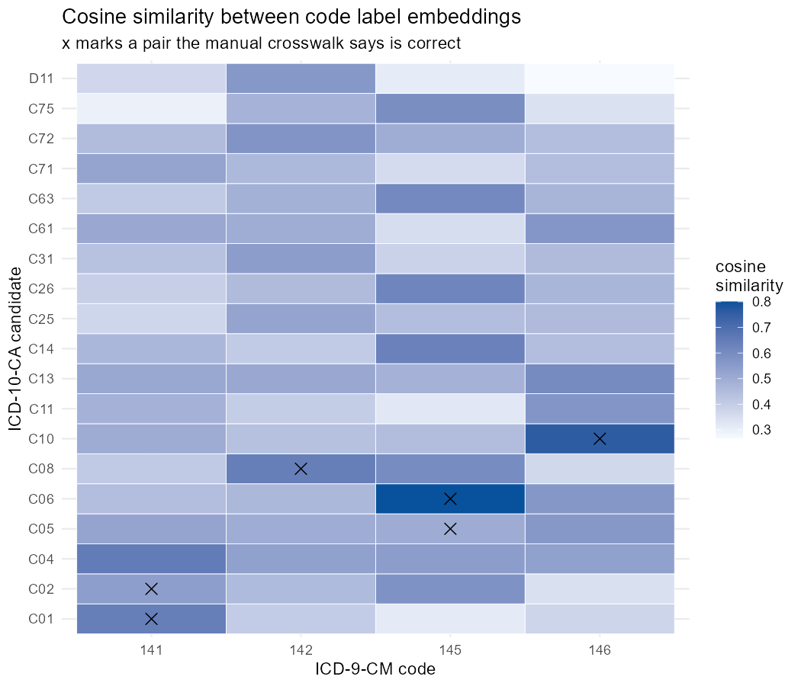
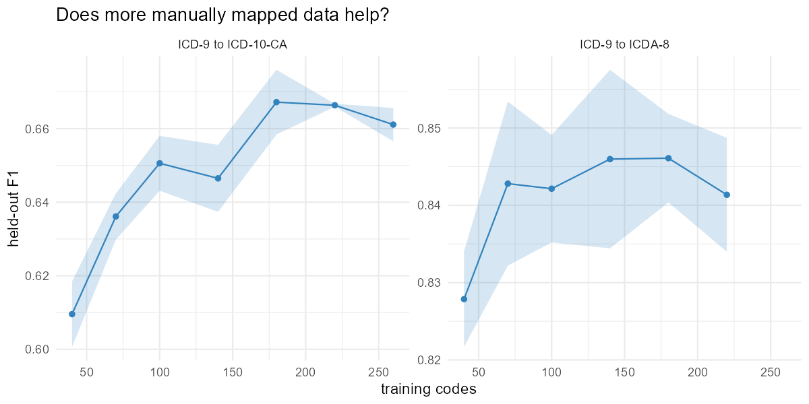
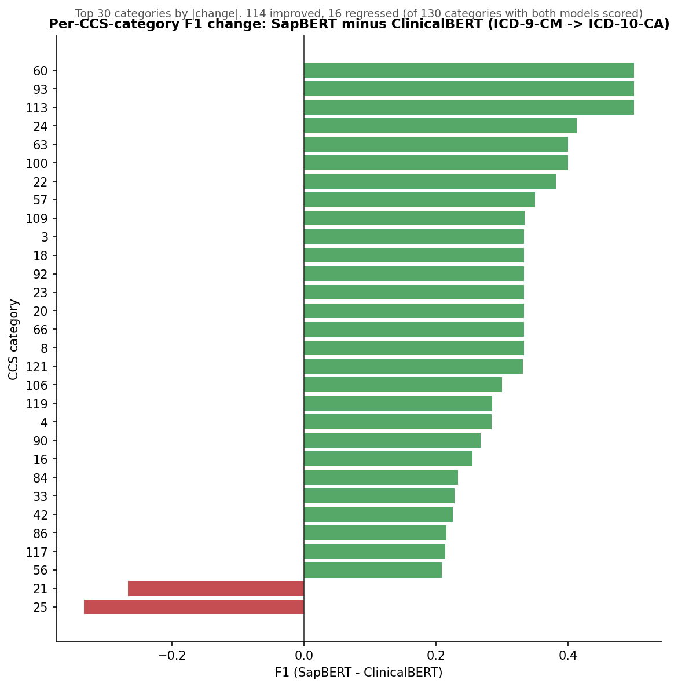

# ICD crosswalk automation: report

Every change from the original pipeline to the current one, in order.

## Abstract

The original pipeline embedded ICD code labels with ClinicalBERT, kept targets
whose cosine similarity was close to each code's best score, added the top-n
most frequently co-occurring targets, dropped pairs whose ICD chapters did not
align, and output whatever passed one of three rules. Best F1 was 0.427 on
ICD-9 to ICD-10-CA and 0.716 on ICD-9 to ICDA-8.

I rebuilt it in R and confirmed those numbers. SapBERT in place of ClinicalBERT
took ICD-10-CA from 0.427 to 0.530. But the model was not the limit. The
similarity cutoff discarded 63% of correct ICD-10-CA pairs before anything was
ranked, and a discarded pair cannot be recovered, so nothing downstream could
have scored above 0.770. Those pairs come back if the cutoff is replaced with a
fixed number of candidates per code, which is what says the retrieval step was
the problem rather than the model.

I widened the candidate step and added a second model that scores what survives.
Held-out F1 is now 0.668 on ICD-10-CA and 0.840 on ICDA-8. Each mapping carries
a confidence score, so 86% of codes auto-accept at 95% precision.

The remaining errors are one problem. Codes with a single correct target are
solved 87-88% of the time on both tracks. Codes with several are solved 6% on
ICD-10-CA and 0% on ICDA-8. 63% of ICD-9 codes have multiple ICD-10-CA targets
against 8% for ICDA-8, so that accounts for the whole gap between tracks.

---

## What the similarity matrix is

Every code label is turned into a vector by the model. Cosine similarity is the
angle between two vectors, from 0 to 1. The matrix holds that number for every
ICD-9 code against every candidate target.

Columns are ICD-9-CM codes, rows are ICD-10-CA candidates, each cell is one
cosine similarity. An x marks a pair the manual crosswalk says is correct. For
ICD-9 141, malignant neoplasm of tongue, the top scores are C04 at 0.653, C01 at
0.643 and C02 at 0.542. C01 and C02 are the correct answers, C04 is not.

The full ICD-10-CA matrix is 354 columns by 2038 rows, 721,452 numbers, split
across one sheet per CCS group. The pipeline never sees the whole thing at once.

Run `scripts/24_show_similarity_matrix.R` to print this for any code.

---

## 1. Reimplementation

- Ported both Python notebooks to R. Same steps, same order.
- The original validated against the CIHI crosswalk table, not in the shared
  folder. Repointed at the validation sheets that are shared.
- Original top-n ranges differed by track: 1-10 for ICD-10-CA, 5-30 for ICDA-8.
  Both now sweep 3-30. The ICD-10-CA optimum is at 30, past where the original
  stopped. That is why 0.427 would not reproduce at first.
- Similarity cutoffs were 0.99, 0.995, 0.999, 1.0. Added 0.95. A cutoff of 1.0
  only keeps exact ties with the best score.
- With both fixes the R port reproduces 0.427 and 0.716 exactly.
- Vectorized the chapter lookup and dropped `rowwise()` from the merge. 130x
  faster, identical output, verified by a diff script.

## 2. Model comparison

Regenerated every model's embeddings with one script so the arms are
comparable. 112 settings per track, eight conditions.

| model | ICD-10-CA F1 | ICDA-8 F1 |
|---|---|---|
| ClinicalBERT (original) | 0.427 | 0.716 |
| ClinicalBERT (regenerated) | 0.430 | 0.716 |
| ClinicalBERT, filler stripped | 0.448 | 0.722 |
| SapBERT | 0.530 | 0.821 |
| SapBERT, filler stripped | 0.534 | 0.806 |
| all-mpnet-base-v2 | 0.533 | 0.769 |
| all-mpnet-base-v2, filler stripped | 0.523 | 0.766 |

- SapBERT is the best single model, +0.10 and +0.11 over ClinicalBERT.
- all-mpnet-base-v2 has no medical training and ties SapBERT on ICD-10-CA.
  Domain pretraining is not the deciding factor.
- Filler stripping helps ClinicalBERT, hurts SapBERT. Off by default.
- Fixed a bug where condition tags differing only by case wrote to the same file
  on Windows and parallel jobs overwrote each other. Reran all eight.

## 3. Filler words

- Compared the hand-written list against NLTK, Snowball, SMART, stopwords-iso.
- Large lists are unsafe. SMART merges 17 codes, stopwords-iso merges 20. They
  strip single letters and words like "with" and "without", so "hepatitis a" and
  "hepatitis b" collapse to the same string.
- Removed `other`, `others`, `unspecified`, `with`, `without` from the local
  list. Those five merged 10 codes.
- Added a check that fails if the list merges any two codes.

## 4. Error analysis

Traced every correct pair through the pipeline. Share of correct pairs still
alive at each stage.

| stage | ICD-10-CA | ICDA-8 |
|---|---|---|
| past the similarity cutoff | 37.1% | 79.5% |
| in the top-n co-occurrence list | 55.4% | 71.6% |
| in the candidate pool | 62.6% | 85.2% |
| output by the three rules | 42.9% | 78.5% |
| best F1 reachable from the pool | 0.770 | 0.920 |

Checked first that all 100% of correct pairs have a cell in the matrix. That is
true by construction, since the matrix scores every ICD-9 code against every
target code, so it is a check that no validation pair names a code missing from
the label files, not a result. It only matters as the denominator for the rows
above.

- The cutoff discards 63% of correct ICD-10-CA pairs before anything is ranked,
  and a discarded pair cannot come back.
- Those pairs were recoverable, which is the actual evidence that the model was
  not the limit. Replacing the relative cutoff with a fixed top-k per code,
  dropping the chapter filter and widening the co-occurrence list moves the
  ceiling from 0.770 to 0.927 on ICD-10-CA and 0.920 to 0.976 on ICDA-8. A
  better model is not what unlocks that, keeping more candidates is.
- The chapter filter discards more correct pairs than incorrect ones. Chapter
  alignment is now a feature, not a filter.

## 5. Retrieve and rerank

Candidates: top 10 per code from each model, plus top 50 co-occurring targets.
No chapter filter.

Reranker: xgboost over 52 features.

- similarity, rank and relative score per model
- the same in reverse, scoring the pair from the target side
- mutual nearest neighbour flags, and the gap between the two directions
- how many ICD-9 codes compete for the same target
- reciprocal rank fusion across the three models
- co-occurrence frequency and rank
- lexical overlap: shared tokens, edit distance, shared prefix
- chapter alignment, plus a smoothed rate for how often that chapter pair
  actually maps, learned from training folds only

Output rule: keep a pair if it clears an absolute threshold, or is within a
fraction of the best score for that code, or is the best score for that code.
Both cutoffs tuned on inner folds.

| | ICD-10-CA | ICDA-8 |
|---|---|---|
| original ClinicalBERT | 0.427 | 0.716 |
| SapBERT, original rules | 0.530 | 0.821 |
| SapBERT, original rules, held out | 0.546 | 0.824 |
| retrieve and rerank, held out | **0.668** | **0.840** |

## 6. Evaluation

- Original numbers were in-sample: the grid picked settings on the same pairs it
  scored against. Everything now uses 5-fold cross validation with folds split
  by ICD-9 code, so no code is in both training and test.
- Added confidence scores. Every mapping now carries one, so the output can be
  sorted instead of taken whole.

  Precision against recall as the confidence cutoff moves. ICDA-8 holds near
  perfect precision out to 80% recall. ICD-10-CA starts falling at 45%.

- At a 95% precision target:

| | ICD-10-CA | ICDA-8 |
|---|---|---|
| auto-accept | 86.1% | 84.1% |
| review, low confidence | 13.6% | 11.9% |
| review, no candidate | 0.3% | 4.0% |

- Added top-k accuracy, which separates whether the answer is reachable from
  whether the output rule keeps it:

| | top-1 | top-3 | top-5 |
|---|---|---|---|
| ICD-10-CA | 93.3% | 97.7% | 98.6% |
| ICDA-8 | 88.4% | 93.7% | 94.7% |

## 7. Ablation

One feature group removed at a time, held out.

| removed | ICD-10-CA | delta | ICDA-8 | delta |
|---|---|---|---|---|
| nothing | 0.669 | | 0.854 | |
| reverse direction | 0.606 | -0.063 | 0.843 | -0.011 |
| co-occurrence | 0.618 | -0.051 | 0.819 | -0.035 |
| chapter | 0.618 | -0.051 | 0.851 | -0.003 |
| lexical | 0.655 | -0.015 | 0.854 | -0.000 |
| ClinicalBERT | 0.657 | -0.012 | 0.857 | +0.003 |
| rank fusion | 0.663 | -0.006 | 0.838 | -0.016 |
| mpnet | 0.664 | -0.005 | 0.835 | -0.019 |

- Reverse-direction features are the largest single contributor on ICD-10-CA.
- ClinicalBERT contributes nothing alongside SapBERT and mpnet. Can be dropped.
- `rank:pairwise` and `rank:ndcg` are worse on ICD-10-CA. `rank:ndcg` is
  slightly better on ICDA-8, 0.862 against 0.854.
- Learning curve: plateaus at 100-180 training codes on both tracks. More
  manually mapped pairs of the same kind would not help.

- Category holdout: folds split by CCS category so whole clinical areas are
  unseen. Costs 0.004 on ICD-10-CA, 0.000 on ICDA-8. Not memorizing categories.
- Retrieval sensitivity: 24 settings, results flat. Nothing is finely tuned.

## 8. Code numbers in the model input

Labels were embedded as code plus label. Tested label only.

| | top-1 | recall@10 | recall@25 | recall@50 |
|---|---|---|---|---|
| SapBERT, code + label, ICD-10-CA | 79.7% | 58.5% | 68.3% | 73.5% |
| SapBERT, label only, ICD-10-CA | **90.1%** | 64.8% | 73.8% | 81.5% |
| mpnet, code + label, ICD-10-CA | 80.9% | 65.5% | 77.0% | 85.1% |
| mpnet, label only, ICD-10-CA | **89.9%** | 67.7% | 77.8% | 85.8% |
| SapBERT, code + label, ICDA-8 | **84.1%** | 93.1% | 95.5% | 97.6% |
| SapBERT, label only, ICDA-8 | 81.8% | 90.6% | 92.5% | 94.0% |

- ICD-10-CA gains 10 points of top-1. ICD-9 and ICD-10 numbering are unrelated,
  so the number was noise.
- ICDA-8 loses slightly. 69.8% of ICDA-8 pairs share the source code's number,
  so there the number is signal.
- These are retrieval numbers, SapBERT alone, before reranking. Not the same
  measurement as the 93.3% in section 6, which is the full pipeline.
- Label-only matrices have since been run through the pipeline for ClinicalBERT. See section 11.

## 9. Remaining errors

Completeness per source code at the 95% precision point.

| | ICD-10-CA | ICDA-8 |
|---|---|---|
| all targets found | 39.5% | 81.6% |
| some but not all | 46.2% | 4.4% |
| none | 14.2% | 14.0% |
| single-target codes solved | 86.7% (n=143) | 88.2% (n=271) |
| multi-target codes solved | 6.0% (n=201) | 0.0% (n=22) |

- ICD-9 codes average 2.72 ICD-10-CA targets (max 13, 63.2% multi) and 1.10
  ICDA-8 targets (max 6, 7.9% multi). The original methods document counts the
  same: 127 one-to-one against 218 one-to-many on ICD-10-CA, 278 against 24 on
  ICDA-8.
- Single-target performance is equal across tracks. The track gap is entirely
  the proportion of multi-target codes.
- Checked whether the extra targets of a multi-target code sit in contiguous
  blocks. They partly do. Not implemented.

Per CCS category, SapBERT minus ClinicalBERT on ICD-10-CA. 114 categories
improved, 16 got worse, out of 130 scored by both. The gain is broad, not driven
by a few categories.

## 10. Choosing a stop word dictionary

Began exploring stopwords dictionarys:
- R's SMART `stopwords`, largest library but removes all single letters and negations
- R's Snowball `stopwords`, moderately large and removes negations as well as letters i and a when as a word
- NTLK, also moderately large and removes letters i a s t d m o y as well as negations

Experimented by modifying the Snowball library to not remove negations (no/not/nor) and letters. Positive result

## 11. Stop words and code numbers, run with ClinicalBERT

Four ClinicalBERT runs, same parameter grid each time. Only the text fed to the
model changes. Best F1 per cell.

ICD-9 to ICD-10-CA

| | code in text | code removed |
|---|---|---|
| stop words kept | 0.430 | 0.465 |
| stop words removed | 0.436 | 0.482 |

ICD-9 to ICDA-8

| | code in text | code removed |
|---|---|---|
| stop words kept | 0.716 | 0.718 |
| stop words removed | 0.719 | 0.713 |

- Removing stop words gains 0.006 on ICD-10-CA with the code in, 0.017 with the
  code out. On ICDA-8 it moves nothing.
- Removing the code number is the larger effect, 0.035 to 0.046 on ICD-10-CA.
  This agrees with section 8.
- The two changes stack. Best cell is stop words out and code out, 0.482 against
  0.427 for the original ClinicalBERT setup.
- ICDA-8 sits at 0.713 to 0.719 whatever is done. Nothing in the text cleaning
  moves that track.

Both versions of the dictionary were run.

| | as published (175) | keeping letters (170) |
|---|---|---|
| ICD-10-CA | 0.439 | 0.436 |
| ICDA-8 | 0.717 | 0.719 |

- No real difference in score. The reason to keep the letters is the labels
  themselves, not the F1. As published, "vitamin a deficiency" becomes "vitamin
  deficiency" and "acute hepatitis a" becomes "acute hepatitis".
- Run `scripts/28_stopwords_and_codes.R` for the tables above and
  `scripts/26_stopword_choice.R` for the affected labels. 
## 12. Frequency distributions

Both inputs the original pipeline thresholds on, described rather than assumed.

Maximum cosine similarity per ICD-9 code, ClinicalBERT, 354 codes on each track.

| | ICD-10-CA | ICDA-8 |
|---|---|---|
| minimum | 0.853 | 0.865 |
| median | 0.930 | 0.968 |
| codes whose best match is an identical label | 0 | 98 (27.7%) |

- ICDA-8 is shifted right and has a spike at 1.0. 98 ICD-9 codes have an ICDA-8
  code with the exact same label, so the match is free.
- No ICD-10-CA code has that. ICD-10-CA was rewritten, ICDA-8 was not.
- This is the cleanest single explanation for the gap between the two tracks.
  It is a property of the code sets, not of the method.
- Every code scores above 0.85, which is why a fixed cutoff does not work and
  the original used a cutoff relative to each code's own best score.

Co-occurrence count of the most frequent target per ICD-9 code.

| | ICD-10-CA | ICDA-8 |
|---|---|---|
| codes with any co-occurrence data | 347 of 354 | 270 of 354 |
| codes with none | 7 (2.0%) | 84 (23.7%) |
| median count | 1,296 | 326 |
| maximum count | 238,548 | 19,099 |

- Counts span five orders of magnitude, so raw frequency is not comparable
  across codes. The reranker uses rank within a code as well as the raw count.
- A quarter of ICD-9 codes have no ICDA-8 co-occurrence data at all. For those
  the co-occurrence step contributes nothing and the model is on its own.

Run `scripts/25_frequency_distributions.R`.

---

## Scripts to run

Each of these prints its own results from cached files. None recompute anything,
all finish in a second or two.

| script | shows |
|---|---|
| `24_show_similarity_matrix.R` | what a similarity matrix looks like, with the correct answers marked |
| `25_frequency_distributions.R` | section 12 |
| `26_stopword_choice.R` | which dictionary deletes what, and which labels break |
| `27_show_results.R` | every headline number in this report |
| `28_stopwords_and_codes.R` | section 11 |

Open `icd_crosswalk.Rproj` in RStudio first so the working directory is the
repo root, then `source("scripts/27_show_results.R")`.
