# Report

## 1. Rebuilding the Pipeline

I rebuilt the original analysis from the source data, keeping the same steps in
the same order, so that later changes could be compared against a working
reproduction rather than against reported figures.

Two differences had to be resolved before the original results could be
reproduced. First, the original validated against the CIHI crosswalk table,
which is not in the shared project folder, so I repointed the validation step
at the validation sheets that are shared. Second, the range of co-occurrence Top
N values differed between the two crosswalks in the original code, running from
1 to 10 for ICD-10-CA and from 5 to 30 for ICDA-8. I swept 3 to 30 for both.
The best ICD-10-CA result occurs at a Top N of 30, which is beyond the point
where the original search stopped, and this is why the F1 score of 0.427 did not
reproduce at first. I also added 0.95 to the list of similarity thresholds,
since a threshold of 1.0 keeps only candidates tied with the highest score.

With both corrections the rebuild reproduces 0.427 and 0.716 exactly, scored
the way the original scored it. Section 2 changes that scoring, and every
number after this section is measured the new way.

I also rewrote the chapter alignment lookup and the merging step to work on
whole columns at once rather than row by row. This made the pipeline
approximately 130 times faster with identical output, which is what made the
larger parameter searches described below practical.

---

## 2. Scoring Every Code, Including Those With No Correct Answer

Every number in this report depends on which codes get graded, so this comes
before the results.

Some ICD-9-CM codes have no match in the target system. ICDA-8 dates from 1968
and has no code for secondary diabetes mellitus, so ICD-9-CM 249 has no correct
answer. There are 9 such codes on ICD-10-CA and 52 on ICDA-8. The reference
crosswalk lists them with no partner.

The original pipeline removed these codes at the validation step, after the
automatic mappings had been produced and before true and false positives were
counted. They were mapped like any other code. Their mappings were then deleted
before anything was scored. A wrong answer on one of them cost nothing.

They are now scored. Both crosswalks are evaluated on all 354 codes rather than
345 and 302.

This is a change to the grading, not to the pipeline. Candidate generation,
co-occurrence, the chapter filter and the mapping rules are untouched and
produce exactly the same mappings as before. The only difference is that more
of those mappings are now counted.

Two consequences run through the rest of the report.

The best parameter setting had to be chosen again for every model. The old
settings were the ones that maximised the old score, so keeping them would
compare models at settings picked under a rule no longer in use. The full
112-point search was rerun and each model is reported at its own best point
under the new scoring.

The search now prefers rules that stay quiet without evidence. On ICDA-8
all-mpnet-base-v2 moved from a rule that fires on label similarity alone to one
that requires the two codes to co-occur in patient records. Nothing instructed
it to be more cautious. Not guessing became worth something, so the search
found it.

**Table 1. Effect of scoring the unmatched codes, best F1 per model.**

| Model | ICD-10-CA before | after | ICDA-8 before | after |
|---|---|---|---|---|
| ClinicalBERT | 0.427 | 0.423 | 0.716 | 0.716 |
| SapBERT | 0.530 | 0.524 | 0.821 | 0.761 |
| all-mpnet-base-v2 | 0.533 | 0.527 | 0.769 | 0.741 |

ICD-10-CA barely moves. Nine codes is too small a share of 354 to shift a
pooled score.

ICDA-8 moves, and only for some models. SapBERT loses 0.060, ClinicalBERT loses
nothing. The reason is which mapping rule each one wins with. ClinicalBERT's
best rule only accepts a pair when the two codes co-occur in patient records,
and 84 of the 354 ICD-9-CM codes have no co-occurrence data at all. It stays
silent on those, so it was never charged for them. SapBERT's best rule fires on
label similarity, which always exists, so it maps 50 of the 52 codes that have
no correct answer. ICD-9-CM 249, secondary diabetes, is mapped to ICDA-8 250,
diabetes mellitus, at 0.834 similarity. That is a different disease and there
was no right answer to find.

Staying silent is not free either. The same rule that keeps ClinicalBERT quiet
on all 52 unmatched codes also keeps it quiet on 39 of the 302 codes that do
have answers. SapBERT is silent on 2 and 5 of those two groups. Caution costs
ClinicalBERT more in missed mappings than it saves in avoided mistakes, which
is why SapBERT still scores higher on ICDA-8.

Scoring these codes catches the mistakes. Mapping one of them is a false
positive now, which is the whole of SapBERT's 0.060 drop, and that is what the
change was for.

What F1 cannot do is give credit for getting them right. It counts hits and
mistakes, and a code with no correct answer offers no hit to earn, so staying
silent registers as nothing at all. ClinicalBERT is silent on all 52 and scores
0.716 either way. That is the same figure it would get if the 52 were still
excluded from the evaluation entirely. Handling them perfectly and never being
tested on them are indistinguishable in F1.

So F1 shows these codes when the pipeline fails them, not when it handles them.
Table 2 reports the other half directly.

**Table 2. ICD-9-CM codes the pipeline correctly returns nothing for.**

| Model | ICD-10-CA, of 9 | ICDA-8, of 52 |
|---|---|---|
| ClinicalBERT | 0 | 52 |
| SapBERT | 0 | 2 |
| all-mpnet-base-v2 | 0 | 52 |

Read this column with the paragraph above it. ClinicalBERT's 52 out of 52 is
not judgement about which codes deserve an answer. It is one rule declining to
fire whenever co-occurrence data is missing, which is correct on these 52 codes
and wrong on 39 others.

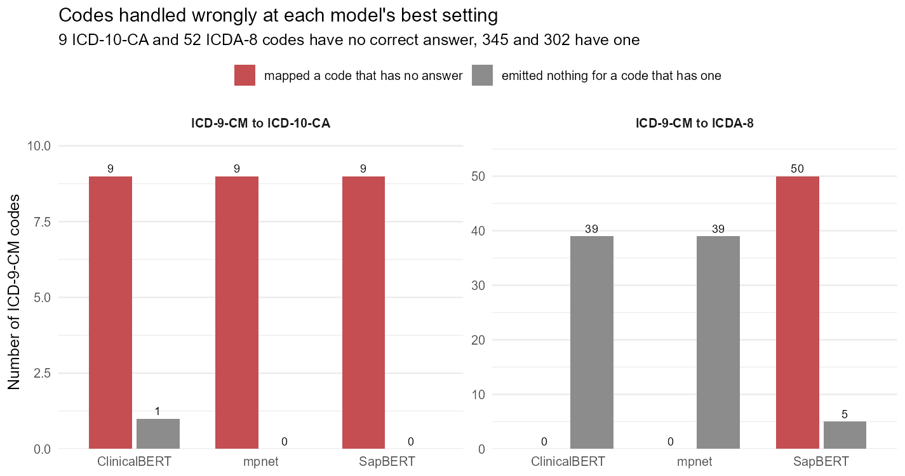

**Figure 1. Codes handled wrongly at each model's best setting.** Red counts
codes with no correct answer that were mapped anyway. Grey counts codes that do
have an answer and were given nothing. Counts rather than percentages, because
the two groups are different sizes.

On ICDA-8 the two bars trade places. ClinicalBERT and all-mpnet-base-v2 map none
of the 52 and miss 39 of the 302. SapBERT maps 50 of the 52 and misses 5. The
mapping rule accounts for both bars in each case: one fires only when the codes
co-occur in records, the other on label similarity alone.

On ICD-10-CA every model maps all 9 and misses at most 1, so the panel separates
nothing. It is included because leaving it out would show only the crosswalk
where the effect appears.

---

## 3. Comparing Language Models

ClinicalBERT was published in 2019. I tested two more recent models in its
place. SapBERT is trained specifically on medical vocabulary and the
relationships between medical terms. The second, all-mpnet-base-v2, is a
general-purpose model with no medical training at all, included as a control.

To keep the comparison fair I regenerated the embeddings for all three models
with one script, using the same text cleaning and the same settings. Each model
was then run over the same 112 parameter combinations per crosswalk.

A single best score hides how much of that score is parameter luck, so each
model is reported at its best setting, its median setting and its worst.

**Table 3. F1 score by embedding model, across all 112 parameter settings.**

| Model | ICD-10-CA best | median | min | ICDA-8 best | median | min |
|---|---|---|---|---|---|---|
| ClinicalBERT (original results) | 0.423 | 0.401 | 0.226 | 0.716 | 0.647 | 0.447 |
| ClinicalBERT (regenerated) | 0.426 | 0.400 | 0.222 | 0.716 | 0.647 | 0.447 |
| SapBERT | 0.524 | 0.482 | 0.364 | 0.761 | 0.734 | 0.718 |
| all-mpnet-base-v2 | 0.527 | 0.488 | 0.370 | 0.741 | 0.701 | 0.685 |

**Figure 2. F1 and accuracy for each model across all 112 parameter settings.**
The dot is the best setting, the dash the median, and the line runs down to the
worst. A model is a range, not a point, and the range is what a single
best-score bar chart hides.

The ICDA-8 panel makes the case on its own. SapBERT's worst setting, 0.718, is
above ClinicalBERT's best, 0.716. ClinicalBERT reaches 0.716 once and otherwise
sits far below it.

SapBERT gains about 0.10 F1 on ICD-10-CA. On ICDA-8 the best-to-best gain is
0.046, which is inside the measurement noise, so at their best settings the two
models should be called tied on that crosswalk. Section 9 gives the intervals.

The spread tells a second story that the best scores hide. On ICDA-8
ClinicalBERT runs from 0.447 to 0.716 across the grid, a spread of 0.269. It
only reaches 0.716 at one corner. SapBERT runs from 0.718 to 0.761, a spread of
0.043, and its worst setting still beats ClinicalBERT's best. Compared at
median settings rather than best, SapBERT leads by 0.087.

Both readings are true and both belong in the table. The models tie only if
ClinicalBERT is allowed to pick its luckiest parameters.

The control result matters most. all-mpnet-base-v2 has no medical training and
matches SapBERT on ICD-10-CA, 0.527 against 0.524. Medical pre-training is not
what decides this task. That was the first sign the model was not the
constraint.

---

## 4. Finding Where Correct Mappings Were Lost

This section contains the central finding of the work.

Rather than only measuring the final score, I followed every manually mapped
pair through the pipeline and recorded the stage at which it was lost. A pair
removed at an early stage cannot be recovered by a later one, so the earliest
loss sets an upper limit on everything that follows.

**Table 4. Percentage of manually mapped pairs still present at each stage of
the original pipeline.**

| Stage | ICD-9-CM to ICD-10-CA | ICD-9-CM to ICDA-8 |
|---|---|---|
| Passed the Step 1 similarity cutoff | 37.1% | 79.5% |
| Present in the Step 2 co-occurrence list | 55.4% | 71.6% |
| Present in the candidate set after Step 3 | 62.6% | 85.2% |
| Reported by the Step 4 mapping algorithms | 42.9% | 78.5% |
| Best F1 obtainable from the candidate set | 0.770 | 0.920 |

The similarity cutoff in Step 1 discards 63% of the correct ICD-10-CA pairs
before any mapping algorithm is applied. Because those pairs are gone, the best
F1 score that Step 4 could possibly have achieved was 0.770, no matter which
mapping algorithm was chosen or how the parameters were tuned.

I then tested whether those discarded pairs were recoverable. Replacing the
relative similarity cutoff with a fixed number of candidates per ICD-9-CM code,
removing the chapter filter, and lengthening the co-occurrence list raises the
best obtainable F1 score from 0.770 to 0.927 for ICD-10-CA and from 0.920 to
0.976 for ICDA-8. The correct answers were present and ranked highly enough to
be retrieved. They were being discarded by the selection rule rather than missed
by the model, and this is the evidence that the model was not the limiting
factor.

I also examined the chapter distance filter in Step 3 on its own. Across 168
matched designs, on both crosswalks, there is not one in which the filter
improves the best obtainable F1 score. It costs 0.016 on ICD-10-CA and 0.005 on
ICDA-8, and it destroys 48 correct ICD-10-CA pairs and 3 correct ICDA-8 pairs
outright. It does remove far more incorrect pairs than correct ones, roughly
5,000 against 21 in a typical design, but the incorrect ones would have been
rejected by Step 4 in any case, whereas a correct pair it deletes is
unrecoverable.

---

## 5. Including the Code Number in the Text

The original analysis combined each ICD code with its label into a single text
string before embedding, so that the model received text such as "250 diabetes
mellitus" rather than "diabetes mellitus". I tested the effect of embedding the
label alone.

The tables below report retrieval results only, measured on the similarity
scores before Step 4 selects anything.

**Table 5. Effect of removing the code number, ICD-9-CM to ICD-10-CA.**

| | Correct target ranked highest | In top 10 | In top 25 | In top 50 |
|---|---|---|---|---|
| ClinicalBERT, code and label | 34.8% ± 2.6 | 27.7% | 35.0% | 43.4% |
| ClinicalBERT, label only | **58.6% ± 2.7** | 33.9% | 41.2% | 48.5% |
| SapBERT, code and label | 79.7% ± 2.1 | 58.5% | 68.3% | 73.5% |
| SapBERT, label only | **90.1% ± 1.6** | 64.8% | 73.8% | 81.5% |
| all-mpnet-base-v2, code and label | 80.9% ± 2.2 | 65.5% | 77.0% | 85.1% |
| all-mpnet-base-v2, label only | **89.9% ± 1.6** | 67.7% | 77.8% | 85.8% |

**Table 6. Effect of removing the code number, ICD-9-CM to ICDA-8.**

| | Correct target ranked highest | In top 10 | In top 25 | In top 50 |
|---|---|---|---|---|
| ClinicalBERT, code and label | **58.3% ± 2.9** | 69.2% | 76.7% | 80.4% |
| ClinicalBERT, label only | 55.0% ± 2.9 | 62.5% | 69.5% | 73.7% |
| SapBERT, code and label | **84.1% ± 2.1** | 93.1% | 95.5% | 97.6% |
| SapBERT, label only | 81.8% ± 2.2 | 90.6% | 92.5% | 94.0% |
| all-mpnet-base-v2, code and label | **77.8% ± 2.4** | 87.3% | 93.1% | 95.8% |
| all-mpnet-base-v2, label only | 74.5% ± 2.5 | 85.2% | 90.9% | 94.9% |

The plus or minus figures are bootstrap standard deviations, obtained as in
Section 9 by resampling the ICD-9-CM codes 2,000 times.

The three gains on ICD-10-CA are large and all sit well clear of zero:
+23.8 ± 2.8 points for ClinicalBERT, +10.4 ± 1.8 for SapBERT and +9.0 ± 1.8 for
all-mpnet-base-v2. The three declines on ICDA-8 are much smaller, -3.3 ± 1.9,
-2.3 ± 1.5 and -3.3 ± 1.6 points, and only the last has an interval excluding
zero. The right reading is that removing the code number clearly helps on
ICD-10-CA and does not help on ICDA-8, rather than that it clearly hurts there.

Because the direction is the same for every model, the explanation lies in the
code sets rather than in any particular model. ICD-9-CM and
ICD-10-CA numbering are unrelated, so the number carries no useful information
and acts as noise. By contrast, 69.8% of ICD-9-CM to ICDA-8 pairs share the same
code number, so for that crosswalk the number is genuinely informative.

ClinicalBERT benefits most, gaining 23.8 percentage points on ICD-10-CA compared
with 10.4 for SapBERT and 9.0 for all-mpnet-base-v2. ClinicalBERT is also the
weakest of the three at reading the labels themselves, which suggests it was
relying on the code number more heavily than the others.

---

## 6. Choosing a Standard Stop Word Dictionary

Stop words are common words such as "the", "of" and "and" that carry little
meaning on their own. The original analysis did not remove them.

I compared four published English dictionaries. The important consideration is
not the size of the dictionary but whether removing its words causes two
different codes to end up with the same cleaned label, since the pipeline cannot
distinguish codes in that situation.

**Table 7. Published stop word dictionaries compared.**

| Dictionary | Words | Codes made identical |
|---|---|---|
| Snowball | 175 | 4 |
| NLTK | 179 | 8 |
| SMART | 571 | 23 |
| stopwords-iso | 1298 | 26 |

Snowball causes the fewest collisions.

Snowball nonetheless has one weakness for this application. It removes the
single letters "a" and "i", so that "vitamin a deficiency" becomes "vitamin
deficiency" and "acute hepatitis a" becomes "acute hepatitis", which loses
exactly the character that distinguishes those codes from their neighbours. It
also removes "no", "not" and "nor", which reverse the meaning of a label.
Retaining those five words leaves a dictionary of 170 words that still alters
2,347 labels, compared with 2,381 for the full list, and causes no collisions at
all.

---

## 7. Applying Stop Word Removal to ClinicalBERT

I reran ClinicalBERT under all four combinations of removing stop words and
removing the code number, using the same parameter search each time, so that the
only difference between the four results is the text given to the model.

**Table 8. Best F1 score for ClinicalBERT under each text preparation.**

| ICD-9-CM to ICD-10-CA | Code number included | Code number removed |
|---|---|---|
| Stop words retained | 0.426 ± 0.014 | 0.461 ± 0.016 |
| Stop words removed | 0.432 ± 0.015 | **0.478 ± 0.015** |

| ICD-9-CM to ICDA-8 | Code number included | Code number removed |
|---|---|---|
| Stop words retained | 0.716 ± 0.023 | 0.718 ± 0.022 |
| Stop words removed | 0.719 ± 0.022 | 0.713 ± 0.024 |

**Figure 3. Best F1 score for ClinicalBERT under each combination of text
preparation.**

Each of the four differences was also measured with the paired bootstrap
described in Section 9, which is what separates a real effect from a redraw of
the code set.

**Table 8a. What each text change is worth on ICD-9-CM to ICD-10-CA.**

| Change | Difference in F1 | 95% interval |
|---|---|---|
| Remove the code number, stop words retained | +0.035 ± 0.009 | +0.017 to +0.054 |
| Remove stop words, code number retained | +0.006 ± 0.008 | -0.010 to +0.021 |
| Remove stop words, code number already removed | +0.017 ± 0.009 | -0.001 to +0.035 |
| Both changes together | +0.052 ± 0.009 | +0.034 to +0.071 |

Removing the code number is the change that carries the result, worth 0.035 on
its own with an interval well clear of zero. Removing stop words on its own is
worth 0.006 with an interval that includes zero, so it cannot be claimed as an
improvement from this evidence. Applied on top of the code number removal it is
worth 0.017, and that interval touches zero too. The two together give 0.478
against 0.426, and that combined gain is solid, but it is the code number doing
the work.

On ICDA-8 none of the four differences clears zero. The result stays between
0.713 and 0.719 whatever is done to the text, and every difference is 0.006 or
smaller against a standard deviation of 0.023. Nothing in the cleaning process
affects that crosswalk.

I also ran both versions of the Snowball dictionary so that the choice
described in Section 6 could be made on evidence.

**Table 9. Best F1 score with each version of the Snowball dictionary.**

| | Snowball as published (175 words) | Snowball retaining letters and negations (170 words) |
|---|---|---|
| ICD-9-CM to ICD-10-CA | 0.434 ± 0.015 | 0.432 ± 0.015 |
| ICD-9-CM to ICDA-8 | 0.717 ± 0.022 | 0.719 ± 0.022 |

The two versions differ by 0.003 on ICD-10-CA and 0.002 on ICDA-8, in opposite
directions, against standard deviations of 0.015 and 0.022. That is at the limit
of what this data can resolve and neither version can be called better. The
reason to prefer the one that retains the five words is therefore not the F1
score but the labels themselves, since the published version silently removes
the letter that identifies several vitamin deficiency and hepatitis codes.

---

## 8. What the Similarity and Co-occurrence Numbers Look Like

Steps 1 and 2 of the original pipeline each cut a list short using a number.
Step 1 uses the similarity score and Step 2 uses how often two codes appear
together in the health records.

### The similarity score

For each of the 354 ICD-9-CM codes I took its best similarity score against any
target code.

**Table 10. Best similarity score available for each ICD-9-CM code,
ClinicalBERT.**

| | ICD-9-CM to ICD-10-CA | ICD-9-CM to ICDA-8 |
|---|---|---|
| Lowest | 0.853 | 0.865 |
| Middle value | 0.930 | 0.968 |
| Codes whose best match is a word for word identical label | 0 | 98 |

**Figure 4. How the best available similarity score is spread across the 354
ICD-9-CM codes.**

Two things follow from this.

The first is that every code has a best match above 0.85, so there is no single
score that separates good matches from bad ones. A score of 0.90 might be the
best match one code has and only the tenth best another code has. This is why
the original analysis compared each candidate against that code's own best score
instead of using one fixed cutoff, and that was the right decision.

The second is that ICDA-8 scores higher across the board. Of the 354 ICD-9-CM
codes, 98 have an ICDA-8 code whose label is word for word identical, so those
mappings need no interpretation at all. Not one ICD-9-CM code has an identical
label to an ICD-10-CA code, because ICD-10-CA was rewritten while ICDA-8 was
not. This is the simplest explanation for why every ICDA-8 result in this
document is higher than the matching ICD-10-CA result. It is a difference
between the code sets, not between the methods.

### How often two codes appear together

**Table 11. How often the most frequent partner of each ICD-9-CM code appears
alongside it.**

| | ICD-9-CM to ICD-10-CA | ICD-9-CM to ICDA-8 |
|---|---|---|
| Codes with co-occurrence data | 347 of 354 | 270 of 354 |
| Codes with none | 7 | 84 |
| Middle value | 1,296 | 326 |
| Highest | 238,548 | 19,099 |

**Figure 5. How the co-occurrence count of each code's most frequent partner is
spread, on a scale where each step is ten times the last.**

The counts differ enormously from one code to another, from single figures up to
238,548. A count of 300 is therefore a strong signal for one code and a weak one
for another, and the raw count is not comparable between codes. A count
carries meaning only relative to the other counts for the same ICD-9-CM code.

The other point is that 84 ICD-9-CM codes, close to a quarter, have no ICDA-8
co-occurrence data at all. For those codes Step 2 of the original pipeline
contributes nothing and the mapping rests entirely on the labels.

---

## 9. How Much These Numbers Move

Every score in this document is a single number measured on one set of 354
ICD-9-CM codes. That leaves the question of how much of a difference is a real
difference and how much is the particular codes that happen to be in the set.

I measured this with a bootstrap. The idea is to treat the 354 codes as a sample
and ask what would have happened if the sample had been slightly different. I
draw 354 codes at random from the set, with replacement, so some codes appear
twice and some not at all, recompute the score on that draw, and repeat 2,000
times. The spread of those 2,000 scores is the standard deviation of the
reported score. Codes are drawn whole, with all of their pairs, because two
pairs belonging to the same ICD-9-CM code are not independent of one another.

**Table 12. Best F1 score with its bootstrap standard deviation and 95%
interval.**

| Model | ICD-9-CM to ICD-10-CA | ICD-9-CM to ICDA-8 |
|---|---|---|
| ClinicalBERT (original results) | 0.423 ± 0.015 (0.395 to 0.452) | 0.716 ± 0.023 (0.670 to 0.759) |
| ClinicalBERT (regenerated) | 0.426 ± 0.015 (0.399 to 0.455) | 0.716 ± 0.023 (0.670 to 0.759) |
| SapBERT | 0.524 ± 0.015 (0.495 to 0.553) | 0.761 ± 0.021 (0.720 to 0.802) |
| all-mpnet-base-v2 | 0.527 ± 0.015 (0.499 to 0.556) | 0.741 ± 0.021 (0.699 to 0.780) |

First row: the score is 0.423, a redraw of the code set typically moves it by
0.015, and 95% of the redraws landed between 0.395 and 0.452. The standard
deviation is about 0.015 on ICD-10-CA and 0.021 on ICDA-8. It is larger on
ICDA-8 because that crosswalk has fewer manually mapped pairs to average over,
331 against 937.

These intervals are wider than a comparison between two models needs. Both
models are scored on the same codes, so a draw holding hard codes pulls both
down together and the gap between them barely moves. Table 13 measures that gap
directly, subtracting one model's score from the other's inside each of the
2,000 draws.

**Table 13. Difference in F1 against the original ClinicalBERT result, measured
inside each bootstrap draw.**

| Comparison | ICD-9-CM to ICD-10-CA | ICD-9-CM to ICDA-8 |
|---|---|---|
| ClinicalBERT regenerated - original | +0.003 ± 0.005 (-0.006 to +0.013) | 0.000 |
| SapBERT - original | +0.101 ± 0.011 (+0.079 to +0.123) | +0.046 ± 0.024 (-0.002 to +0.095) |
| all-mpnet-base-v2 - original | +0.104 ± 0.011 (+0.082 to +0.126) | +0.025 ± 0.008 (+0.010 to +0.042) |
| all-mpnet-base-v2 - SapBERT | +0.003 ± 0.010 (-0.016 to +0.022) | -0.021 ± 0.023 (-0.066 to +0.023) |
| SapBERT, filler stripped - base | +0.005 ± 0.007 (-0.008 to +0.018) | -0.013 ± 0.013 (-0.038 to +0.011) |
| all-mpnet-base-v2, filler stripped - base | -0.010 ± 0.007 (-0.023 to +0.003) | -0.001 ± 0.004 (-0.009 to +0.006) |

Second row: SapBERT scores 0.101 higher than the original result on ICD-10-CA,
the gap moves by 0.011 between redraws, and 95% of the redraws put it between
0.079 and 0.123. The whole interval sits above zero, so the gain does not depend
on which codes were in the set.

Four things follow.

On ICD-10-CA the gains from SapBERT and all-mpnet-base-v2 are larger than the
noise. Both are ahead of the original result in 2,000 of the 2,000 draws. These
are not close calls.

On ICDA-8 the picture changed once the unmatched codes were scored. SapBERT is
0.046 ahead with an interval of -0.002 to +0.095, which touches zero. At their
best settings the two models should be reported as tied on that crosswalk. This
gap was 0.106 and clearly outside the noise before the change in Section 2.

The tie is a statement about best settings only. Table 3 shows ClinicalBERT
reaching 0.716 at one corner of the grid and sitting near 0.647 elsewhere, while
SapBERT stays between 0.718 and 0.761 throughout. all-mpnet-base-v2 beats
ClinicalBERT on ICDA-8 by a smaller margin, 0.025, but that one does clear zero,
because its winning setting behaves like ClinicalBERT's on most codes and the
paired draws move together.

The difference between regenerating ClinicalBERT and the original ClinicalBERT
result is not distinguishable from zero, which is what should happen. It is the
same model on the same task, and the regeneration is only a check that the
reproduction is faithful.

SapBERT and all-mpnet-base-v2 are tied on both crosswalks now, 0.003 apart on
ICD-10-CA and 0.021 apart on ICDA-8, both intervals crossing zero. Filler word
stripping does not clear zero anywhere.

The same treatment is applied to the text preparation results in Section 7 and
to the retrieval results in Section 5, and it changes how two of those should be
read. Removing stop words on its own is worth 0.006 on ICD-10-CA against a
standard deviation of 0.008, so it cannot be claimed as an improvement, and the
declines from removing the code number on ICDA-8 are smaller than their own
intervals for two of the three models. Every reported difference and its
interval is in `results/bootstrap_deltas.csv` and
`results/bootstrap_top1_deltas.csv`.

The revised pipeline described elsewhere is evaluated by five-fold cross
validation rather than on one fixed split, so its spread can be read directly
from the folds. It scores 0.669 ± 0.040 on ICD-10-CA and 0.841 ± 0.057 on
ICDA-8 across the five folds. Fold-to-fold spread is wider than the bootstrap
spread above because each fold is scored on a fifth of the codes.

---

## 10. Performance Across All 130 CCS Categories

The 354 ICD-9-CM codes are grouped into 130 CCS categories, clinical groupings
such as breast cancer, asthma or other nervous system conditions. I scored each
category separately, from the same run at each model's best setting, to see
whether the overall figure is carried by a few areas.

Category sizes are uneven: 59 of the 130 hold a single ICD-9-CM code and the
largest holds 18. A one-code category is scored on one or two pairs, so its F1
swings between 0 and 1 on a single decision. The code count is shown in every
table and chart below.

**Table 14. Spread of F1 across the 130 categories.**

| | Mean over categories | SD | Median | Q1 to Q3 | Perfect | Zero | Pooled F1 |
|---|---|---|---|---|---|---|---|
| ICD-10-CA, ClinicalBERT | 0.525 | 0.252 | 0.490 | 0.333-0.667 | 17 | 3 | 0.423 |
| ICD-10-CA, SapBERT | 0.620 | 0.248 | 0.571 | 0.453-0.800 | 26 | 2 | 0.524 |
| ICD-10-CA, all-mpnet-base-v2 | 0.626 | 0.238 | 0.607 | 0.464-0.800 | 25 | 1 | 0.527 |
| ICDA-8, ClinicalBERT | 0.775 | 0.295 | 1.000 | 0.632-1.000 | 65 | 8 | 0.716 |
| ICDA-8, SapBERT | 0.822 | 0.254 | 1.000 | 0.667-1.000 | 71 | 5 | 0.761 |
| ICDA-8, all-mpnet-base-v2 | 0.799 | 0.255 | 0.947 | 0.667-1.000 | 64 | 5 | 0.741 |

SapBERT on ICD-10-CA: the average category scores 0.620, half of the categories
fall between 0.453 and 0.800, 26 are mapped perfectly and 2 are missed
completely. SapBERT and all-mpnet-base-v2 are level on ICD-10-CA here as they
are everywhere else. On ICDA-8 they are closer than they were before the
unmatched codes were scored, 0.822 against 0.799 by category mean.

The last column is the figure quoted everywhere else in this document, and it is
lower than the first in every row. Pooled F1 counts every code once; the mean
over categories counts every category once, whatever its size. Two categories,
one holding a single code that is mapped correctly and one holding ten codes of
which five are mapped, give a mean over categories of 0.75 and a pooled F1 of
0.55. The small categories are the easy ones, so weighting them equally flatters
the result. Pooled F1 stays the headline number.

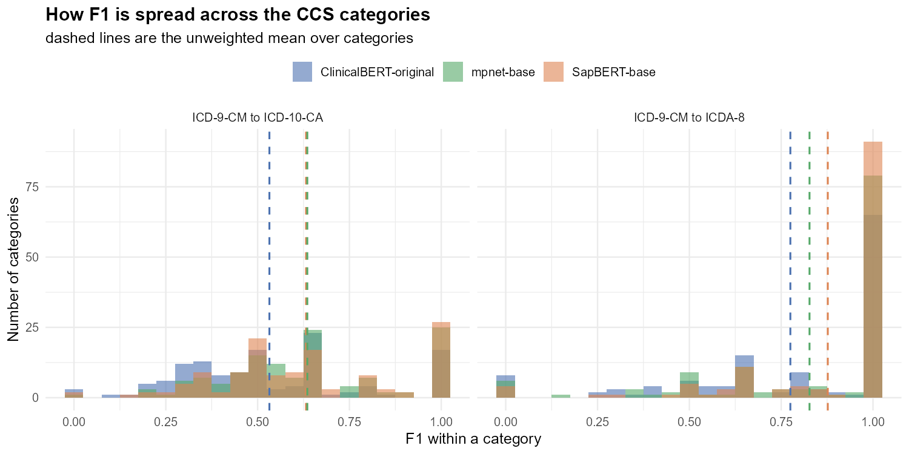

**Figure 6. How F1 is spread across the CCS categories.** One row per model, one
column per crosswalk. Each bar counts the categories scoring in that range, and
the dashed line is that panel's mean over categories. Light shading is
categories holding a single ICD-9-CM code, dark is those holding two or more.

The shading explains the shape. The tall bar at 1.000 on ICDA-8 is mostly
single-code categories, which are scored on one or two pairs and land on 0 or 1
rather than anywhere in between. The categories holding several codes sit in the
middle of the range on both crosswalks. A category mean is therefore pulled
upward by the smallest categories, which is the same point Table 14 makes with
the pooled column.

The spread between categories, an SD of about 0.25, is much larger than the
uncertainty on the overall score in Section 9, about 0.015. The differences
between clinical areas are real, not measurement noise, and one number for the
whole crosswalk hides a range running from 0 to 1.

**Table 15. Mean F1 by how many ICD-9-CM codes the category holds.**

| | 1 code | 2 codes | 3 to 4 codes | 5 or more |
|---|---|---|---|---|
| ICD-10-CA, ClinicalBERT | 0.630 | 0.475 | 0.448 | 0.382 |
| ICD-10-CA, SapBERT | 0.714 | 0.551 | 0.563 | 0.505 |
| ICD-10-CA, all-mpnet-base-v2 | 0.732 | 0.556 | 0.551 | 0.502 |
| ICDA-8, ClinicalBERT | 0.856 | 0.799 | 0.700 | 0.621 |
| ICDA-8, SapBERT | 0.904 | 0.802 | 0.753 | 0.705 |
| ICDA-8, all-mpnet-base-v2 | 0.868 | 0.836 | 0.725 | 0.663 |

Each row holds 59, 23, 27 and 21 categories.

The more codes a category holds, the worse the pipeline does in it. This holds
on both crosswalks and for all three models, with two small reversals: SapBERT
and all-mpnet-base-v2 on ICD-10-CA both score marginally higher in the 3 to 4
group than in the 2-code group, by 0.012 and below, across groups of 23 and 27
categories. With SapBERT on ICD-10-CA the score falls from 0.714 in the
single-code categories to 0.505 in those holding five or more.

A large category is a clinical area ICD-9-CM divided into many closely related
codes, such as the 18 under other nervous system conditions. Their labels are
similar and they appear together in the same records, so both signals the
pipeline uses point at several codes at once. This is the multi-target problem
in a second form, and it is a property of the clinical area rather than of any
one category, which is why the pattern is so regular.

### The charts

One bar per category, ranked best to worst and dealt into three columns so all
130 fit on a page. The bracketed number after each name is how many ICD-9-CM
codes that category holds.

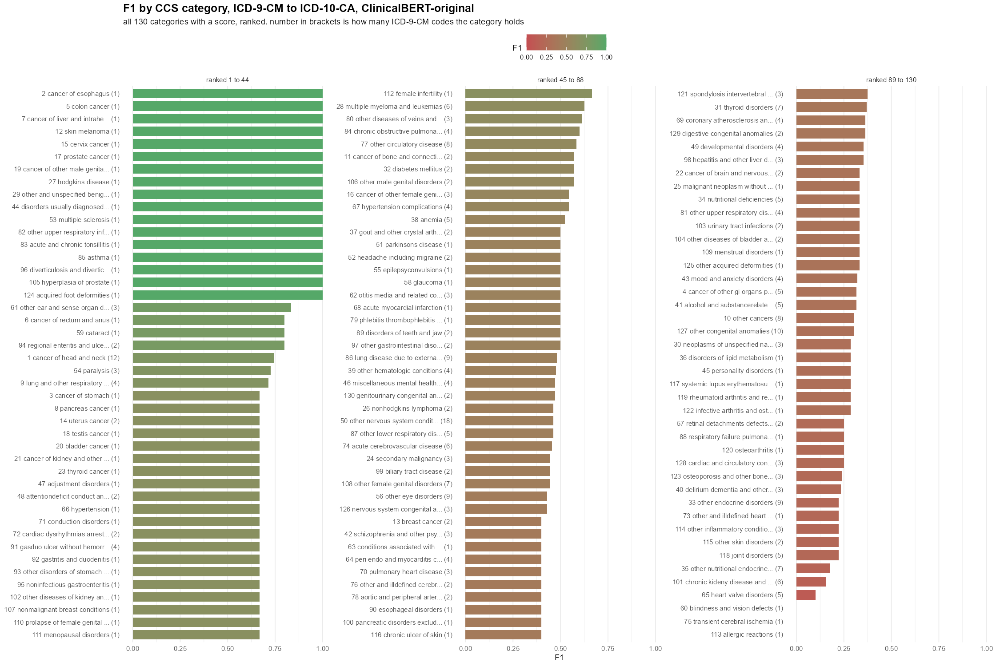

**Figure 7. F1 for every CCS category, ICD-9-CM to ICD-10-CA, ClinicalBERT.**

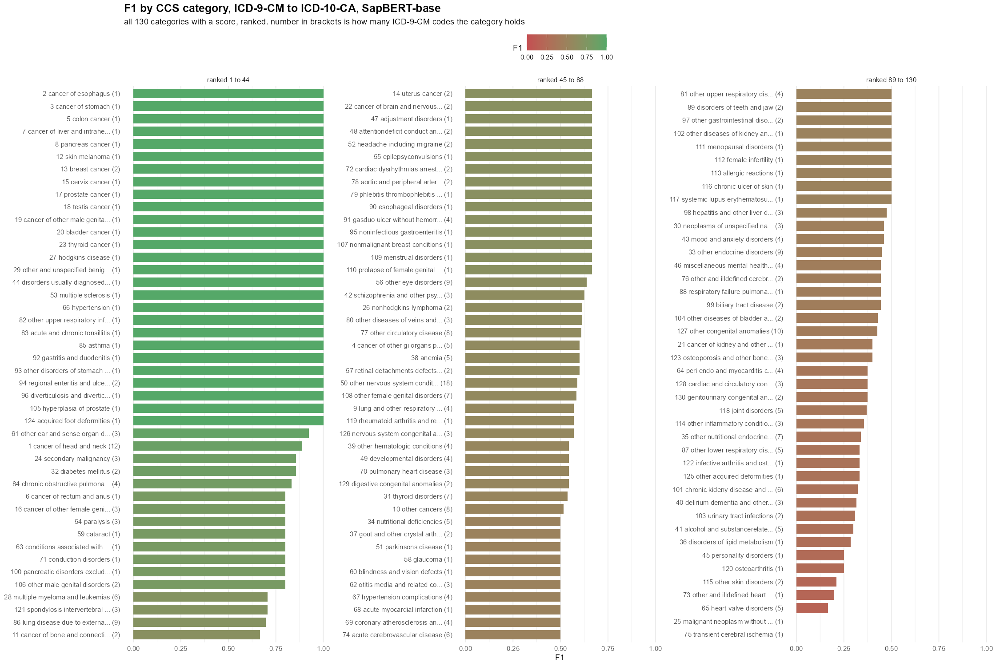

**Figure 8. F1 for every CCS category, ICD-9-CM to ICD-10-CA, SapBERT.**

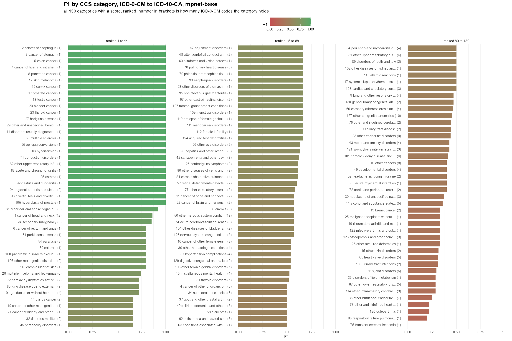

**Figure 9. F1 for every CCS category, ICD-9-CM to ICD-10-CA,
all-mpnet-base-v2.**

On all three the top is mostly single-code cancers and other conditions with one
distinctive label, and the bottom is where ICD-10-CA split or regrouped an
ICD-9-CM code, such as heart valve disorders and other and ill-defined heart
disease. The hard categories are the same categories for every model.

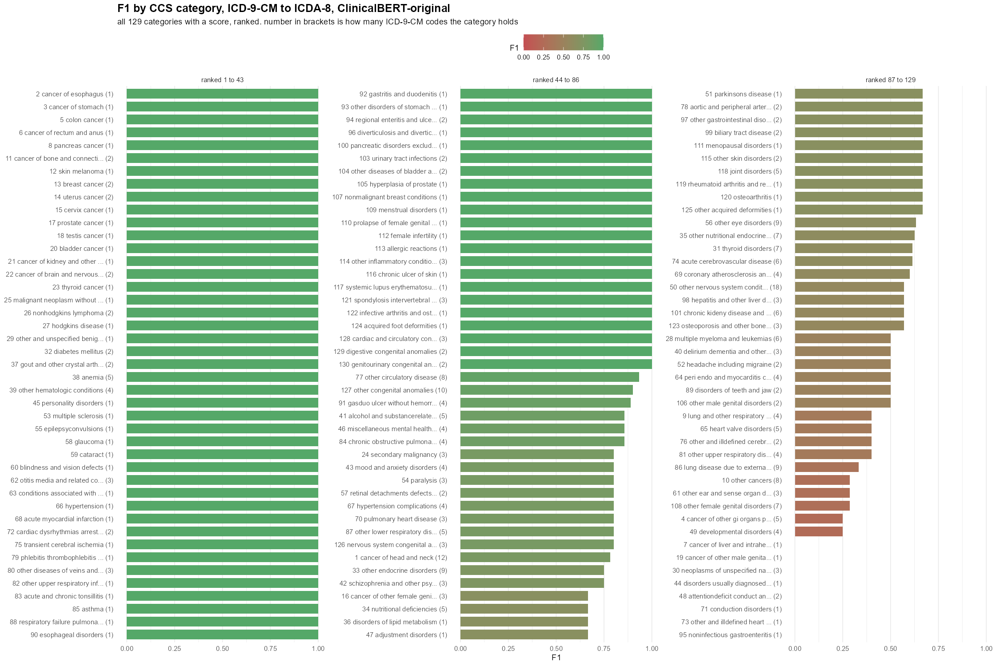

**Figure 10. F1 for every CCS category, ICD-9-CM to ICDA-8, ClinicalBERT.**

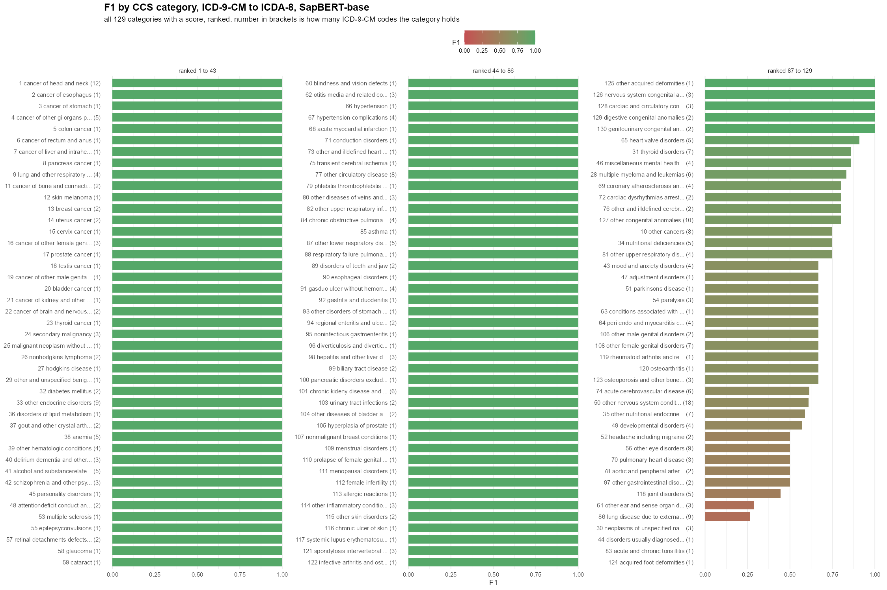

**Figure 11. F1 for every CCS category, ICD-9-CM to ICDA-8, SapBERT.**

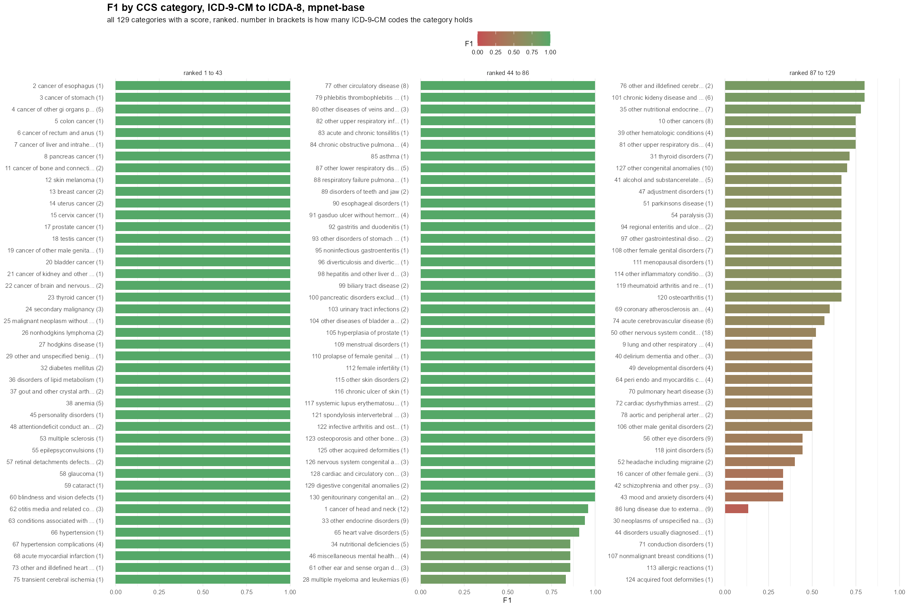

**Figure 12. F1 for every CCS category, ICD-9-CM to ICDA-8,
all-mpnet-base-v2.**

The ICDA-8 charts have a long flat top of categories at 1.000, which is the
identity mapping described in Section 8 showing up category by category.

The next two charts subtract one condition from another, so a bar to the right
means the first named did better in that category.

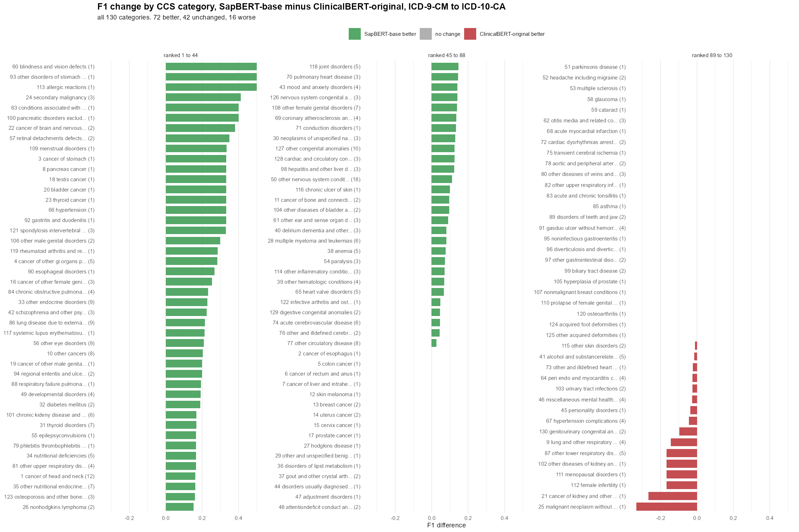

**Figure 13. Change in F1 by category, SapBERT minus ClinicalBERT, ICD-9-CM to
ICD-10-CA.**

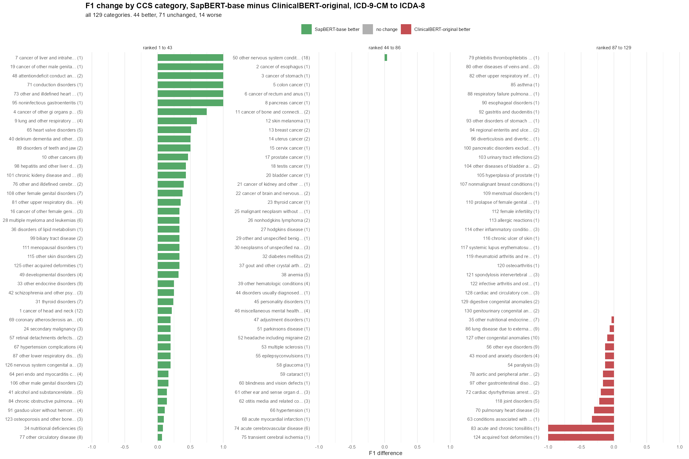

**Figure 14. Change in F1 by category, SapBERT minus ClinicalBERT, ICD-9-CM to
ICDA-8.**

SapBERT is better in 72 categories, level in 41 and worse in 17 on ICD-10-CA,
and better in 38, level in 66 and worse in 25 on ICDA-8. The improvement is
spread across the crosswalk rather than coming from a few categories, so no
clinical area is carrying it. The 17 losses on ICD-10-CA are small and the
largest, 0.333, is a one-code category where a single pair decides the score.
On ICDA-8 the 25 losses include one full category, which is again a single-code
category scored on one pair.

### The text preparation arms

The same breakdown was run on the four ClinicalBERT text preparations from
Section 7, to see whether the text cleaning helps in particular clinical areas
or only in aggregate.

**Table 16. Spread of F1 across categories for each ClinicalBERT text
preparation.**

| | Mean over categories | SD | Perfect | Zero | Pooled F1 |
|---|---|---|---|---|---|
| ICD-10-CA, stop words and code number retained | 0.521 | 0.243 | 15 | 3 | 0.426 |
| ICD-10-CA, code number removed | 0.569 | 0.280 | 27 | 4 | 0.461 |
| ICD-10-CA, stop words removed | 0.537 | 0.264 | 20 | 4 | 0.432 |
| ICD-10-CA, both removed | 0.573 | 0.270 | 24 | 4 | 0.478 |
| ICDA-8, stop words and code number retained | 0.775 | 0.295 | 65 | 8 | 0.716 |
| ICDA-8, code number removed | 0.774 | 0.293 | 64 | 8 | 0.718 |
| ICDA-8, stop words removed | 0.774 | 0.298 | 64 | 9 | 0.719 |
| ICDA-8, both removed | 0.769 | 0.304 | 66 | 9 | 0.713 |

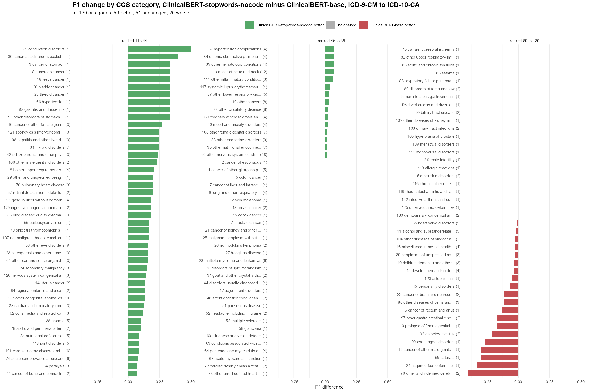

**Figure 15. Change in F1 by category from removing both the stop words and the
code number, ICD-9-CM to ICD-10-CA.**

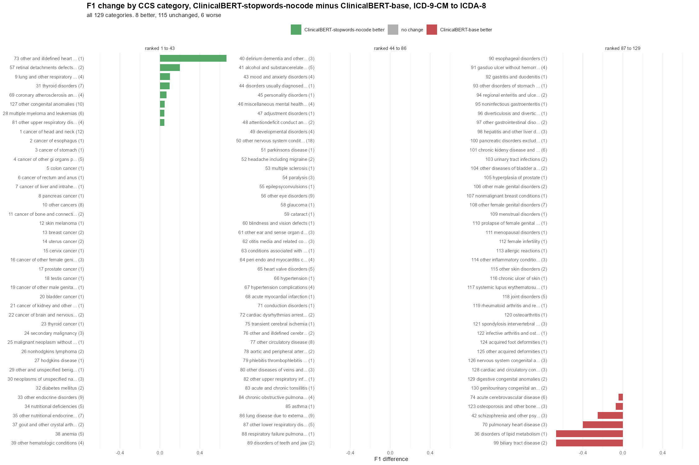

**Figure 16. Change in F1 by category from removing both the stop words and the
code number, ICD-9-CM to ICDA-8.**

On ICD-10-CA the cleaning helps 59 categories, changes nothing in 51 and hurts
20, for a mean gain of 0.052 per category. It is a broad shift rather than a few
categories moving a long way, and the number of categories mapped perfectly rises
from 15 to 24.

On ICDA-8 it changes nothing in 115 of the 129 categories, helps 8 and hurts 6,
for a mean of -0.006. The category breakdown gives the same answer as the
aggregate in Section 7: there is nothing there. This is worth stating because a
null result at the aggregate level can always be a few large gains cancelling a
few large losses, and here it is not, the cleaning simply does not reach that
crosswalk.

Figures 6 to 15 are in `results/` under the names shown. Per-category numbers
for all seven conditions, with the counts each score is built from, are in
`results/ccs_all_categories_10_9.csv` and `results/ccs_all_categories_8_9.csv`,
and the category counts behind Figures 12 to 15 are in
`results/ccs_delta_summary.csv`.

---

## 11. The Codes With No Correct Answer, One At A Time

Section 2 scored these codes and reported one pooled F1 per model. A pooled score
averages 9 or 52 codes in with the 345 or 302 that do have answers, so it cannot
show what happens to any individual code. This section lists them one by one.

The pipeline decides from two numbers, the cosine similarity between two code
labels and how often the two codes appear together in patient records. Every code
below is described on both. The model is ClinicalBERT, the one the original
pipeline used.

### ICD-9-CM to ICD-10-CA, the 9 codes with no match

Each ICD-9-CM code is scored against all 2038 ICD-10-CA codes, so each row below
is a distribution over 2038 numbers.

**Table 17. Cosine similarity of each unmatched ICD-9-CM code against every
ICD-10-CA code.** Nearest target is the single highest scoring one, the score
being the maximum column.

| ICD-9-CM | Label | Mean | Min | Q1 | Median | Q3 | Max | Nearest target |
|---|---|---|---|---|---|---|---|---|
| 175 | malignant neoplasm of male breast | 0.825 | 0.641 | 0.796 | 0.826 | 0.849 | 0.955 | C30, Malignant neoplasm of nasal cavity and middle ear |
| 249 | secondary diabetes mellitus | 0.817 | 0.663 | 0.774 | 0.817 | 0.859 | 0.951 | O24, Diabetes mellitus in pregnancy |
| 239 | neoplasms of unspecified nature | 0.831 | 0.662 | 0.804 | 0.833 | 0.859 | 0.942 | D15, Benign neoplasm of other and unspecified intrathoracic organs |
| 515 | postinflammatory pulmonary fibrosis | 0.852 | 0.694 | 0.823 | 0.858 | 0.886 | 0.932 | N72, Inflammatory disease of cervix uteri |
| 209 | neuroendocrine tumors | 0.836 | 0.693 | 0.808 | 0.842 | 0.867 | 0.915 | A74, Other diseases caused by chlamydiae |
| 327 | organic sleep disorders | 0.770 | 0.541 | 0.725 | 0.773 | 0.823 | 0.915 | P78, Other perinatal digestive system disorders |
| 339 | other headache syndromes | 0.816 | 0.648 | 0.786 | 0.820 | 0.851 | 0.915 | A69, Other spirochaetal infections |
| 338 | pain not elsewhere classified | 0.805 | 0.685 | 0.785 | 0.807 | 0.827 | 0.893 | R52, Pain, not elsewhere classified |
| 445 | atheroembolism | 0.711 | 0.552 | 0.686 | 0.713 | 0.736 | 0.853 | M66, Spontaneous rupture of synovium and tendon |

Every one of these codes reaches a high score. The maxima run from 0.853 to
0.955, and the 345 codes that do have answers reach between 0.861 and 0.981. Seven
of the nine sit above the first quartile of that group and four sit above its
median.

The nearest target is clinically wrong in eight of the nine rows. ICD-9-CM 175,
malignant neoplasm of male breast, is nearest to C30, malignant neoplasm of nasal
cavity and middle ear, at 0.955. ICD-9-CM 515, postinflammatory pulmonary
fibrosis, is nearest to N72, inflammatory disease of cervix uteri. ICD-9-CM 445,
atheroembolism, is nearest to M66, spontaneous rupture of synovium and tendon.
The scores are as high as the ones the pipeline is right about, and the answers
are not close.

The exception is ICD-9-CM 338, pain not elsewhere classified, whose nearest
target is R52, pain not elsewhere classified, the same phrase. The reference
crosswalk records no match for it. That is worth checking against the reference
standard rather than assuming the pipeline is wrong there.

Now the second signal. All 9 codes appear in the co-occurrence file, so all 9
have empirical data.

**Table 18. Co-occurrence of each unmatched ICD-9-CM code.** Partners is the
number of ICD-10-CA codes it shares a record with. The quartile and maximum
describe the counts across those partners.

| ICD-9-CM | Label | Partners | Median | Q3 | Highest | Most frequent partner |
|---|---|---|---|---|---|---|
| 338 | pain not elsewhere classified | 827 | 49 | 181.5 | 13431 | E11, Type 2 diabetes mellitus |
| 515 | postinflammatory pulmonary fibrosis | 306 | 24 | 53.75 | 5194 | J84, Other interstitial pulmonary diseases |
| 239 | neoplasms of unspecified nature | 585 | 34 | 91 | 4862 | I10, Essential (primary) hypertension |
| 327 | organic sleep disorders | 349 | 23 | 49 | 3108 | G47, Other sleep disorders |
| 249 | secondary diabetes mellitus | 161 | 18 | 38 | 1783 | E11, Type 2 diabetes mellitus |
| 209 | neuroendocrine tumors | 124 | 17 | 31.75 | 506 | C78, Secondary malignant neoplasm of respiratory and digestive organs |
| 175 | malignant neoplasm of male breast | 24 | 10.5 | 22.5 | 131 | C79, Secondary malignant neoplasm of other and unspecified sites |
| 339 | other headache syndromes | 58 | 15 | 17.75 | 54 | E11, Type 2 diabetes mellitus |
| 445 | atheroembolism | 2 | 11.5 | 13.75 | 16 | I74, Arterial embolism and thrombosis |

These counts are not low. ICD-9-CM 338 shares a record with 827 different
ICD-10-CA codes and appears with E11, type 2 diabetes, 13431 times. 515 reaches
5194, 239 reaches 4862 and 327 reaches 3108. Only the bottom two rows look the
way a code with no valid target was expected to look, 445 with 2 partners and a
highest count of 16, and 339 with 58 partners and a highest count of 54.

Co-occurrence counts how often a code is recorded, not whether it has a target.
Pain, sleep disorders and unspecified neoplasms are recorded constantly, so they
co-occur with whatever else the patient has.

### ICD-9-CM to ICDA-8, the 52 codes with no match

Co-occurrence first, because there is nothing to tabulate. None of the 52 codes
appear in the co-occurrence file at all. A code is listed there only if it shares
a record with at least one ICDA-8 code, so these 52 have no empirical data
whatsoever, which is different from having a low count. The same gap covers 32 of
the 302 codes that do have answers.

That single fact drives the ICDA-8 results in Section 2. ClinicalBERT's best rule
only fires when two codes co-occur, so it stays silent on all 52. The same rule
is what leaves 39 of the 302 codes with answers unmapped.

Similarity next. Each code is scored against all 858 ICDA-8 codes.

**Table 19. Cosine similarity of each unmatched ICD-9-CM code against every
ICDA-8 code.**

| ICD-9-CM | Label | Mean | Min | Q1 | Median | Q3 | Max | Nearest |
|---|---|---|---|---|---|---|---|---|
| 164 | malignant neoplasm of thymus heart and mediastinum | 0.813 | 0.584 | 0.776 | 0.810 | 0.846 | 0.985 | 142 |
| 175 | malignant neoplasm of male breast | 0.816 | 0.578 | 0.782 | 0.816 | 0.848 | 0.984 | 174 |
| 237 | neoplasm of uncertain behavior of endocrine glands and nervous system | 0.821 | 0.594 | 0.785 | 0.822 | 0.855 | 0.984 | 238 |
| 179 | malignant neoplasm of uterus part unspecified | 0.812 | 0.633 | 0.780 | 0.810 | 0.842 | 0.980 | 149 |
| 238 | neoplasm of uncertain behavior of other and unspecified sites and tissues | 0.814 | 0.626 | 0.777 | 0.811 | 0.845 | 0.977 | 237 |
| 585 | chronic kidney disease | 0.848 | 0.680 | 0.813 | 0.847 | 0.886 | 0.973 | 582 |
| 165 | malignant neoplasm of other and illdefined sites within the respiratory system and intrathoracic organs | 0.796 | 0.587 | 0.755 | 0.795 | 0.832 | 0.971 | 195 |
| 615 | inflammatory diseases of uterus except cervix | 0.855 | 0.631 | 0.828 | 0.863 | 0.890 | 0.971 | 621 |
| 334 | spinocerebellar disease | 0.864 | 0.704 | 0.833 | 0.867 | 0.898 | 0.968 | 348 |
| 721 | spondylosis and allied disorders | 0.863 | 0.675 | 0.830 | 0.868 | 0.902 | 0.968 | 721 |
| 234 | carcinoma in situ of other and unspecified sites | 0.828 | 0.632 | 0.794 | 0.828 | 0.857 | 0.966 | 195 |
| 335 | anterior horn cell disease | 0.851 | 0.674 | 0.816 | 0.856 | 0.889 | 0.965 | 365 |
| 249 | secondary diabetes mellitus | 0.821 | 0.638 | 0.780 | 0.827 | 0.864 | 0.964 | 250 |
| 712 | crystal arthropathies | 0.832 | 0.673 | 0.790 | 0.833 | 0.878 | 0.964 | 523 |
| 230 | carcinoma in situ of digestive organs | 0.839 | 0.616 | 0.808 | 0.840 | 0.873 | 0.963 | 189 |
| 233 | carcinoma in situ of breast and genitourinary system | 0.820 | 0.583 | 0.785 | 0.822 | 0.859 | 0.962 | 184 |
| 516 | other alveolar and parietoalveolar pneumonopathy | 0.868 | 0.686 | 0.849 | 0.873 | 0.896 | 0.961 | 517 |
| 417 | other diseases of pulmonary circulation | 0.826 | 0.697 | 0.796 | 0.825 | 0.858 | 0.960 | 447 |
| 617 | endometriosis | 0.864 | 0.698 | 0.831 | 0.865 | 0.901 | 0.958 | 582 |
| 576 | other disorders of biliary tract | 0.854 | 0.680 | 0.823 | 0.858 | 0.888 | 0.956 | 508 |
| 176 | kaposis sarcoma | 0.855 | 0.668 | 0.826 | 0.862 | 0.888 | 0.955 | 218 |
| 263 | other and unspecified proteincalorie malnutrition | 0.783 | 0.651 | 0.763 | 0.785 | 0.805 | 0.954 | 267 |
| 358 | myoneural disorders | 0.849 | 0.691 | 0.810 | 0.851 | 0.889 | 0.954 | 523 |
| 515 | postinflammatory pulmonary fibrosis | 0.868 | 0.680 | 0.847 | 0.874 | 0.895 | 0.952 | 354 |
| 231 | carcinoma in situ of respiratory system | 0.836 | 0.603 | 0.805 | 0.839 | 0.874 | 0.951 | 212 |
| 555 | regional enteritis | 0.851 | 0.655 | 0.823 | 0.854 | 0.879 | 0.950 | 422 |
| 331 | other cerebral degenerations | 0.832 | 0.679 | 0.803 | 0.835 | 0.862 | 0.949 | 344 |
| 405 | secondary hypertension | 0.836 | 0.649 | 0.807 | 0.840 | 0.869 | 0.949 | 401 |
| 333 | other extrapyramidal disease and abnormal movement disorders | 0.835 | 0.651 | 0.805 | 0.844 | 0.871 | 0.945 | 360 |
| 557 | vascular insufficiency of intestine | 0.867 | 0.711 | 0.842 | 0.870 | 0.898 | 0.945 | 424 |
| 720 | ankylosing spondylitis and other inflammatory spondylopathies | 0.823 | 0.581 | 0.789 | 0.830 | 0.869 | 0.945 | 321 |
| 495 | extrinsic allergic alveolitis | 0.863 | 0.649 | 0.844 | 0.866 | 0.891 | 0.944 | 092 |
| 619 | fistula involving female genital tract | 0.856 | 0.682 | 0.837 | 0.862 | 0.882 | 0.943 | 939 |
| 359 | muscular dystrophies and other myopathies | 0.842 | 0.663 | 0.805 | 0.847 | 0.885 | 0.942 | 733 |
| 382 | suppurative and unspecified otitis media | 0.863 | 0.658 | 0.844 | 0.868 | 0.888 | 0.939 | 612 |
| 316 | psychic factors associated with diseases classified elsewhere | 0.824 | 0.601 | 0.796 | 0.836 | 0.862 | 0.938 | 305 |
| 496 | chronic airway obstruction not elsewhere classified | 0.862 | 0.703 | 0.841 | 0.868 | 0.884 | 0.937 | 584 |
| 713 | arthropathy associated with other disorders classified elsewhere | 0.844 | 0.625 | 0.822 | 0.855 | 0.878 | 0.935 | 775 |
| 508 | respiratory conditions due to other and unspecified external agents | 0.821 | 0.689 | 0.800 | 0.822 | 0.842 | 0.932 | 515 |
| 586 | renal failure unspecified | 0.847 | 0.697 | 0.824 | 0.850 | 0.871 | 0.929 | 583 |
| 259 | other endocrine disorders | 0.818 | 0.667 | 0.784 | 0.821 | 0.853 | 0.928 | 117 |
| 745 | bulbus cordis anomalies and anomalies of cardiac septal closure | 0.845 | 0.724 | 0.825 | 0.846 | 0.870 | 0.928 | 605 |
| 330 | cerebral degenerations usually manifest in childhood | 0.761 | 0.495 | 0.723 | 0.768 | 0.812 | 0.921 | 095 |
| 308 | acute reaction to stress | 0.769 | 0.616 | 0.738 | 0.773 | 0.804 | 0.917 | 307 |
| 327 | organic sleep disorders | 0.804 | 0.617 | 0.765 | 0.803 | 0.849 | 0.917 | 717 |
| 517 | lung involvement in conditions classified elsewhere | 0.840 | 0.662 | 0.822 | 0.849 | 0.867 | 0.917 | 776 |
| 305 | nondependent abuse of drugs | 0.800 | 0.566 | 0.773 | 0.811 | 0.837 | 0.913 | 308 |
| 338 | pain not elsewhere classified | 0.811 | 0.687 | 0.786 | 0.814 | 0.837 | 0.907 | 490 |
| 588 | disorders resulting from impaired renal function | 0.820 | 0.700 | 0.801 | 0.822 | 0.840 | 0.901 | 515 |
| 312 | disturbance of conduct not elsewhere classified | 0.775 | 0.678 | 0.751 | 0.775 | 0.797 | 0.895 | 306 |
| 625 | pain and other symptoms associated with female genital organs | 0.762 | 0.540 | 0.727 | 0.768 | 0.807 | 0.893 | 781 |
| 315 | specific delays in development | 0.777 | 0.671 | 0.752 | 0.776 | 0.800 | 0.883 | 066 |

The maxima run from 0.883 to 0.985. The 302 codes that do have answers run from
0.865 to 1.000, so the two ranges sit almost on top of each other. Twenty-six of
the 52 are above the first quartile of the matched codes and five are above its
median.

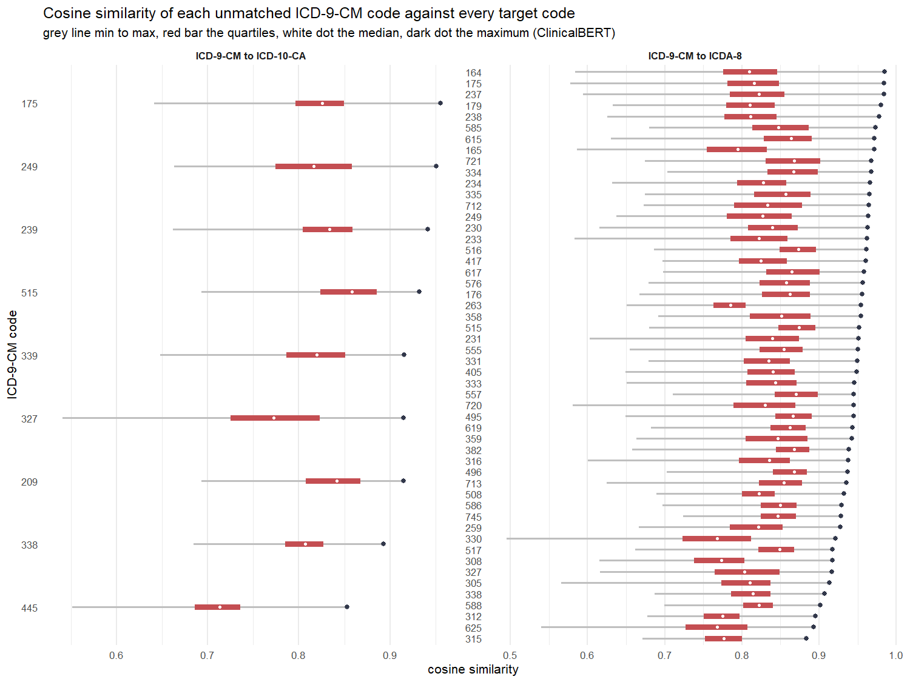

**Figure 17. The full distribution behind each row of Tables 17 and 19.** The
grey line runs from the lowest to the highest score against any target, the red
bar covers the quartiles and the dark dot is the maximum. Every code's quartiles
sit in a narrow band, so what differs between codes is only how far the single
best target stands out from the rest.

### Can a threshold separate these codes

Not on similarity. To clear all 9 ICD-10-CA codes the cutoff on the maximum score
has to sit above 0.955, and that also removes 286 of the 345 codes that do have
answers. On ICDA-8 the cutoff is 0.985 and it removes 175 of 302. There is no
setting that keeps the working mappings and drops these.

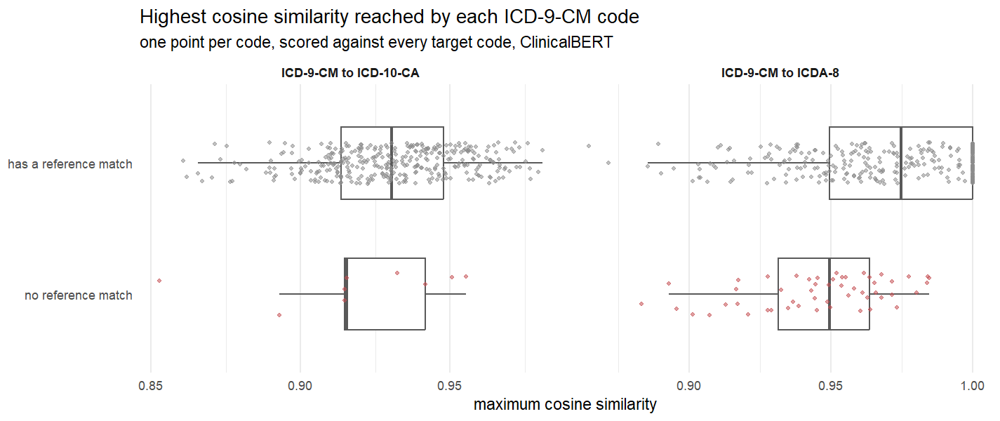

**Figure 18. Highest similarity per code, the codes with no match against the
codes with one.** One point per ICD-9-CM code. The red points sit inside the grey
spread on both crosswalks.

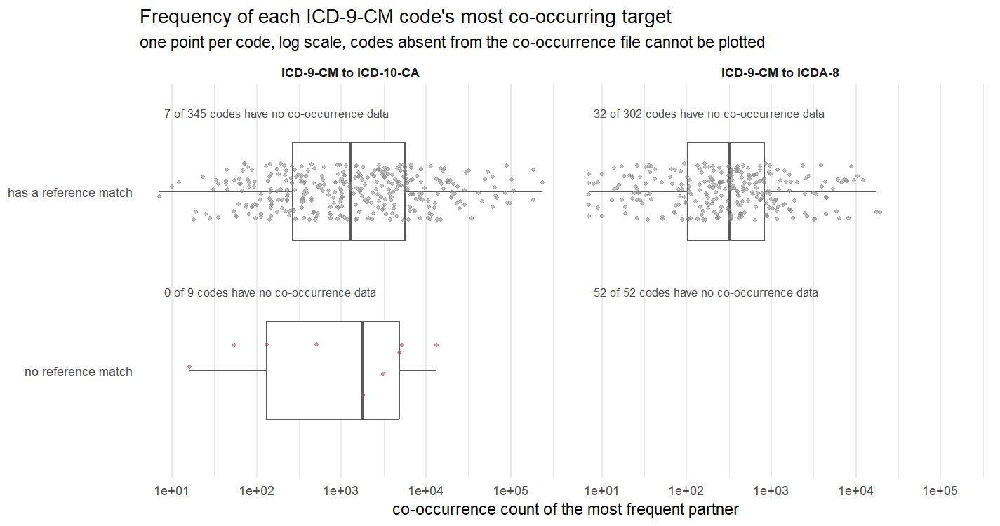

**Figure 19. Highest co-occurrence count per code.** Log scale, one point per
code. Codes missing from the co-occurrence file cannot be drawn, so their count
is written above each row. On ICDA-8 there are no red points at all because all
52 are missing. On ICD-10-CA the red points sit inside the grey spread.

One thing worth being exact about, because it explains why the pipeline maps
these codes at all. The similarity threshold in the pipeline is not an absolute
cutoff. It keeps every target scoring within a fraction of that code's own
highest score, between 0.95 and 0.999 depending on the setting, so a code's best
target always survives it. No score is ever low enough to be rejected. A code
only goes quiet on the similarity side when the chapter filter removes all of its
candidates, which happens for 2 of the 52 on ICDA-8, codes 327 and 330. That is
why every model maps all 9 ICD-10-CA codes.

SapBERT and all-mpnet-base-v2 were run through the same descriptives and give the
same answer, with the scores sitting lower and spread wider. Their numbers are in
the summary file below.

### Where this is

`scripts/36_unmatched_descriptives.R` produces all of it and takes about three
minutes. It reads the committed data and changes nothing in the pipeline.

| File | Contents |
|---|---|
| `results/unmatched_similarity_by_code.csv` | Tables 17 and 19 for all three models, with the nearest target and its label |
| `results/unmatched_cooccurrence_by_code.csv` | Table 18, and the same for every other code |
| `results/unmatched_top_cooccurrence_pairs.csv` | the three most frequent partners of each code |
| `results/unmatched_descriptives_summary.csv` | the group level numbers and the cutoff figures |
| `results/plot_unmatched_similarity_spread.png` | Figure 17 |
| `results/plot_unmatched_similarity_max.png` | Figure 18 |
| `results/plot_unmatched_cooccurrence.png` | Figure 19 |

Section 2 and `scripts/35_unmatched_codes.R` cover what the pipeline currently
does with these codes. This section covers what the two signals look like for
them.
